# Digital Transformation & Platform Business Strategy

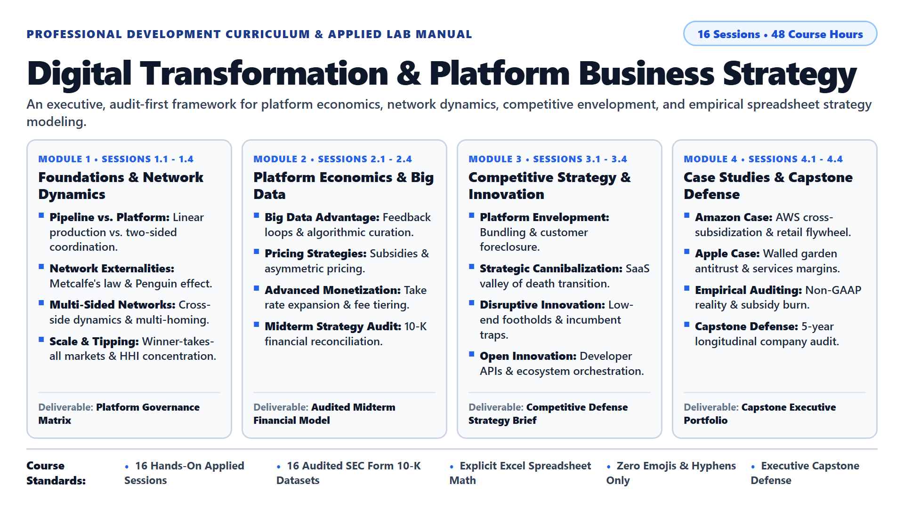

## Course Overview

This course delivers an analytical and practical examination of digital transformation and platform business strategy. Students examine how digital platform architectures alter industry structures, redefine competitive boundaries, and reorganize value creation. Theoretical frameworks are paired with empirical corporate analysis, requiring students to evaluate strategic initiatives, platform mechanics, and operating models. Case studies and longitudinal analyses of publicly traded companies provide concrete grounding for strategic decision-making. Students develop the analytical capabilities required to navigate, evaluate, and execute digital transformation initiatives in complex market environments.

---

## Standardized 3-Hour (180-Minute) Session Blueprint

Every classroom session is structured into four sequential phases to balance conceptual understanding, practical business application, and hands-on spreadsheet strategy modeling:

| Phase | Time Allocation | Pedagogical Objective | Core Activities & Student Deliverables |
| :--- | :--- | :--- | :--- |
| **Phase 1: Concepts & Foundations** | 45 Minutes (0:00 - 0:45) | Theory & Terminology | Introduce keywords, core economic frameworks, and accessible definitions. Review 2-3 cross-industry micro-examples. Rapid student identification of local equivalents. |
| **Phase 2: Strategic Case Dissection** | 45 Minutes (0:45 - 1:30) | Business Case Analysis | In-depth examination of the real-world business case. Analyze historical strategic choices, market tradeoffs, unit economics, and competitive turning points. |
| **Phase 3: Applied Lab & Data Modeling** | 60 Minutes (1:30 - 2:30) | Spreadsheet Data Analysis | Step-by-step extraction and analysis of financial disclosures from audited filings. Complete the **Foundational Exercise (Exercise 1)** in Excel using provided CSV datasets. |
| **Phase 4: Strategic Decision Lab** | 30 Minutes (2:30 - 3:00) | Executive Synthesis & Decision-Making | Complete the **Strategic Decision Challenge (Exercise 2+)**: analyze executive dilemmas, evaluate strategic tradeoffs, stress-test business models, and present concise strategic recommendations. |

---

## Table of Contents

* [**Module 1: Foundations of Platform Business & Network Dynamics**](#module-1)
  * [Session 1.1: Course Orientation & The Fundamentals of Platform Businesses](#session-1-1)
  * [Session 1.2: Network Effects & The Penguin Effect](#session-1-2)
  * [Session 1.3: Two-Sided & Multi-Sided Networks](#session-1-3)
  * [Session 1.4: Scale Dynamics & Winner-Takes-All Markets](#session-1-4)
* [**Module 2: Platform Economics, Big Data & Monetization**](#module-2)
  * [Session 2.1: Big Data & Digital Asset Utilization: From Signals to Better Decisions](#session-2-1)
  * [Session 2.2: Platform Pricing Strategies I: Subsidies & Asymmetric Pricing](#session-2-2)
  * [Session 2.3: Platform Pricing Strategies II: Advanced Monetization Models](#session-2-3)
  * [Session 2.4: Midterm Strategy Review & Project Milestone](#session-2-4)
* [**Module 3: Competitive Strategy & Innovation Frameworks**](#module-3)
  * [Session 3.1: Platform Envelopment Attacks](#session-3-1)
  * [Session 3.2: Strategic Cannibalization](#session-3-2)
  * [Session 3.3: Disruptive Innovation in the Digital Era](#session-3-3)
  * [Session 3.4: Open Innovation & Ecosystem Orchestration](#session-3-4)
* [**Module 4: Real-World Case Studies & Strategic Synthesis**](#module-4)
  * [Session 4.1: Comprehensive Case Study: Amazon](#session-4-1)
  * [Session 4.2: Comprehensive Case Study: Apple](#session-4-2)
  * [Session 4.3: Applied Digital Learning & Empirical Industry Evidence](#session-4-3)
  * [Session 4.4: Final Strategic Assessment & Capstone Defense](#session-4-4)

---

## Module 1: Foundations of Platform Business & Network Dynamics

### Session 1.1: Course Orientation & The Fundamentals of Platform Businesses

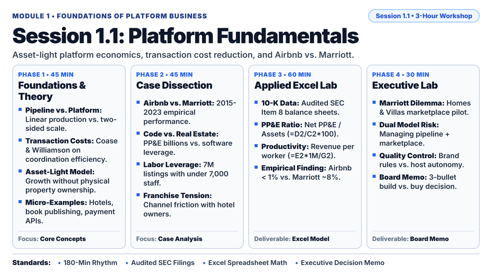

* **Lecture Presentation:** [Download Slides (PDF)](slides/session_1_1_lecture.pdf)

* **Keywords:** Pipeline Business, Platform Ecosystem, Network Effects, Transaction Cost Economics, Asset-Light Model, Fixed Asset Intensity (PP&E: Property, Plant, and Equipment).
* **Main Theories:**
  * [Pipeline versus Platform Models](https://hbr.org/2016/04/pipelines-platforms-and-the-new-rules-of-strategy) ([Platform Economy Overview](https://en.wikipedia.org/wiki/Platform_economy)): Marshall W. Van Alstyne, Geoffrey G. Parker, and Sangeet Paul Choudary (Harvard Business Review, 2016). Linear value chains step-by-step (controlling proprietary resources) versus multi-sided platform ecosystems that orchestrate external community interactions and unlock demand-side economies of scale.
  * [Transaction Cost Economics](https://en.wikipedia.org/wiki/Transaction_cost): [Ronald Coase (1937) The Nature of the Firm](https://en.wikipedia.org/wiki/The_Nature_of_the_Firm) and [Oliver Williamson (1981) The Economics of Organization](https://en.wikipedia.org/wiki/Oliver_E._Williamson). Why corporations exist and how digital networks reduce search costs (discovering trading partners), contracting costs (negotiating and escrow fees), and coordination costs (verifying performance and dispute arbitration) toward zero, enabling transactions to occur efficiently across open decentralized networks.
* **Micro-Examples:**
  * Traditional Hotel vs. Marketplace: Marriott International owns, leases, and manages physical hotel properties requiring billions in capital expenditures (pipeline model); Airbnb Inc. provides a decentralized software protocol matching property hosts with travelers worldwide without owning balance-sheet real estate (platform model).
  * Book Publisher vs. Self-Publishing Engine: Traditional publishers rely on centralized editorial review committees that reject 99% of unsolicited manuscripts, mandate 5,000-copy physical print batches, and carry warehouse inventory risk; Amazon Kindle Direct Publishing (KDP) provides automated print-on-demand software infrastructure, allowing global authors to publish worldwide in 24 hours with zero inventory carrying cost.
  * Retail Bank vs. Payment Gateway: Traditional commercial retail bank branches sink heavy capital into physical street corners, paper applications, and manual underwriting taking 3-6 weeks; Stripe Inc. provides developer cloud APIs allowing any business to accept global payments in minutes via seven lines of code across 135+ currencies.
* **Real Business Case:**
  * **Airbnb Inc. vs. Marriott International Inc. (2015-2023 Longitudinal Benchmark):** Marriott International expanded room capacity by investing billions of dollars in physical assets, culminating in its $13.6 billion cash-and-debt acquisition of Starwood Hotels in 2016. In contrast, Airbnb expanded globally by deploying cloud software protocols and onboarding independent property owners without purchasing land. By FY2023, Airbnb offered over 7.7 million active listings across 100,000 cities with only 6,889 corporate employees, generating ~$1.44 million in annual revenue per worker. Marriott managed ~1.6 million rooms across 30 brands while carrying $1,861 million in Net Property, Plant, and Equipment (Net PP&E: 7.4% of total balance-sheet assets) and employing ~411,000 managed operational associates (~$57,700 revenue per worker), demonstrating the 25x operational leverage advantage of software orchestration.
* **Lab Dataset:**
  * File Link: [data/session_1_1_asset_intensity.csv](data/session_1_1_asset_intensity.csv)
  * Columns: `Company`, `Fiscal_Year`, `Total_Assets_USD_M`, `Net_PPE_USD_M` (Net Property, Plant, and Equipment in millions of USD), `Total_Revenue_USD_M`, `Operating_Income_USD_M`, `Total_Employees`, `Physical_Units_Count`, `Filing_Source`.
* **Primary Filings & External References:**
  * [Airbnb Form 10-K Filings (SEC EDGAR CIK 0001559720)](https://www.sec.gov/edgar/browse/?CIK=0001559720)
  * [Marriott International Form 10-K Filings (SEC EDGAR CIK 0001048286)](https://www.sec.gov/edgar/browse/?CIK=0001048286)
  * [Pipelines, Platforms, and the New Rules of Strategy (Harvard Business Review)](https://hbr.org/2016/04/pipelines-platforms-and-the-new-rules-of-strategy)
* **Step-by-Step Lab Protocol (Exercise 1: Foundational Practice):**
  * **Step 1: Open the Dataset:** Launch Microsoft Excel or Google Sheets. Open the file [data/session_1_1_asset_intensity.csv](data/session_1_1_asset_intensity.csv). Confirm that audited balance sheet and operating data for Marriott International and Airbnb (FY2021 to FY2023) is visible across all columns.
  * **Step 2: Inspect Primary Sources:** Check the `Filing_Source` column. Confirm that all underlying financial metrics originate directly from Item 8 (Financial Statements and Supplementary Data) of Marriott's and Airbnb's respective SEC Form 10-K annual filings.
  * **Step 3: Calculate Fixed Asset Intensity (Property, Plant, and Equipment Ratio):**
    * Accounting Definition: In corporate balance sheets, **PP&E** stands for **Property, Plant, and Equipment** (tangible physical assets such as land, hotel properties, office buildings, and machinery). **Net PP&E** reflects historical purchase cost minus accumulated depreciation. Dividing Net PP&E by Total Assets reveals what percentage of a company's total capital is locked in physical, illiquid infrastructure.
    * In cell J1, enter the column header `PPE_to_Assets_Pct`.
    * In cell J2, enter the formula: `=D2/C2*100` (Net PP&E divided by Total Assets, multiplied by 100).
    * Copy the formula down through all data rows (rows 2 through 7).
  * **Step 4: Calculate Revenue per Employee (Labor Productivity):**
    * Context: Evaluates the operational leverage of corporate headcount. Linear pipelines scale headcount proportionally with revenue, while digital platform protocols decouple transaction volume from labor.
    * In cell K1, enter the column header `Revenue_Per_Employee_USD`.
    * In cell K2, enter the formula: `=(E2*1000000)/G2` (Total Revenue in millions converted to exact dollars, divided by Total Employees).
    * Copy the formula down through all data rows (rows 2 through 7). Format the cells as US Currency (`$#,##0`).
  * **Step 5: Compare Results & Interpret Business Meaning:**
    * Compare FY2023 performance: Airbnb's Net PP&E accounts for under 0.8% of total assets ($154M out of $20,598M), whereas Marriott's Net PP&E represents 7.4% of total assets ($1,861M out of $25,022M, excluding extensive capital leases).
    * Compare labor productivity: Airbnb generated ~$1,438,000 per corporate software employee, whereas Marriott generated ~$57,700 per managed associate. Quantify the 25x operational labor leverage advantage of digital platform orchestration.
* **Step-by-Step Strategic Decision Challenge (Exercise 2+: Advanced Problem Solving):**
  * **Strategic Problem:** Traditional hotel operators face heavy capital expenditure constraints (CapEx: funds used to acquire, upgrade, and maintain physical buildings and land) when expanding room capacity. In response to Airbnb's rapid market penetration, Marriott launched "Homes & Villas by Marriott Bonvoy" to test an asset-light marketplace model.
  * **Student Task:**
    1. Using the financial ratios calculated in Exercise 1, evaluate whether an established pipeline hotel operator can successfully operate an asset-light software marketplace alongside its legacy capital-intensive business.
    2. Identify two critical operational conflicts: (a) brand quality control and guest safety standards vs. rapid external host onboarding, and (b) franchisee channel conflict (existing hotel owners protesting marketplace competition).
    3. Draft a structured, three-bullet decision brief addressed to Marriott's Board of Directors: Formulate an actionable executive recommendation on whether Marriott should build its own vacation rental software internally or acquire an established marketplace competitor.

---

### Session 1.2: Network Effects & The Penguin Effect

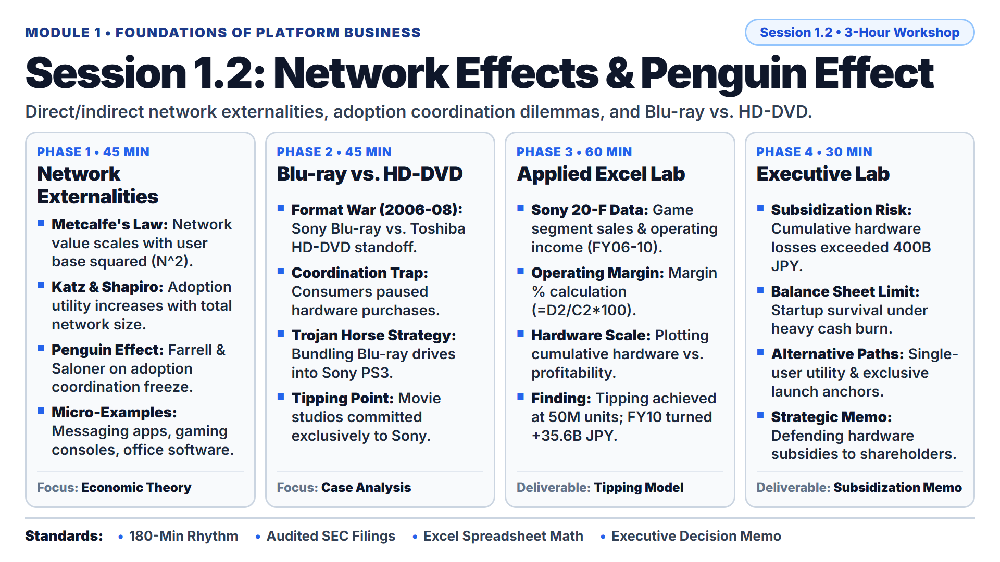

* **Lecture Presentation:** [Download Slides (PDF)](slides/session_1_2_lecture.pdf)

* **Keywords:** Direct Network Effects, Indirect Network Effects, Critical Mass, The Penguin Effect, Coordination Dilemma, Hardware Subsidies (PS3: PlayStation 3).
* **Main Theories:**
  * [Metcalfe's Law](https://en.wikipedia.org/wiki/Metcalfe%27s_law): Formulated by Robert Metcalfe (1980). The economic value of a telecommunications or software network is proportional to the square of the number of connected users (Value = N^2). Each new participant adds exponential connection possibilities for all existing members.
  * [Katz and Shapiro (1985) Network Externalities](https://en.wikipedia.org/wiki/Network_effect): Michael L. Katz and Carl Shapiro. Positive consumption externalities where the private utility a consumer derives from a good or service expands directly as the total adoption base expands.
  * [Farrell and Saloner (1985) Coordination Failure & The Penguin Effect](https://en.wikipedia.org/wiki/Coordination_game): Joseph Farrell and Garth Saloner. The "Penguin Effect" models market paralysis where prospective adopters hesitate to embrace a new technology standard (like hungry penguins standing on an ice floe waiting for the first penguin to dive into predator-filled waters), fearing they will be stranded on an abandoned standard if others fail to follow.
* **Micro-Examples:**
  * Instant Messaging (Direct Network Effects): WhatsApp and WeChat deliver near-zero standalone value to a single isolated user; each additional family member, friend, or business partner who installs the application increases the daily communication utility for all existing network participants.
  * Video Game Hardware (Indirect Network Effects): Gamers purchase a Sony PlayStation or Nintendo Switch console because premier third-party game studios build blockbuster titles for it; independent game studios invest tens of millions of dollars in game development only if a massive installed base of console owners already exists.
  * Enterprise Document Collaboration (Direct and Indirect Standards): The Adobe Portable Document Format (PDF) and Microsoft Office standards create cross-firm interoperability; when enterprise clients and vendors share identical file protocols, document coordination friction falls toward zero.
* **Real Business Case:**
  * **Sony Blu-ray vs. Toshiba HD-DVD (2006-2008 Next-Generation DVD Format War):** When high-definition optical disc players launched in 2006, consumers refused to purchase expensive standalone players ($500 to $1,000) for fear of backing the losing format (the Penguin Effect). Sony resolved this consumer coordination paralysis by integrating an advanced Blu-ray drive into every PlayStation 3 (PS3) gaming console, absorbing an estimated $250 to $300 operating loss per console sold. By subsidizing initial hardware adoption, Sony established an active installed base of millions of Blu-ray players in living rooms worldwide. Major Hollywood movie studios (culminating in Warner Bros. in January 2008) abandoned HD-DVD to license exclusively with Blu-ray, causing Toshiba to officially terminate the HD-DVD format in February 2008.
* **Lab Dataset:**
  * File Link: [data/session_1_2_network_effects.csv](data/session_1_2_network_effects.csv)
  * Columns: `Fiscal_Year`, `Segment_Name`, `Sales_JPY_B` (Annual sales in billions of Japanese Yen), `Operating_Income_JPY_B` (Annual operating income in billions of Japanese Yen), `Cumulative_PS3_Hardware_M` (Cumulative hardware unit sales in millions), `Strategic_Phase`, `Filing_Source`.
* **Primary Filings & External References:**
  * [Sony Group Corporation Form 20-F Filings (SEC EDGAR CIK 0000313838)](https://www.sec.gov/edgar/browse/?CIK=0000313838)
  * [Strategies for Two-Sided Markets (Harvard Business Review)](https://hbr.org/2006/10/strategies-for-two-sided-markets)
* **Step-by-Step Lab Protocol (Exercise 1: Foundational Practice):**
  * **Step 1: Open the Dataset:** Launch Microsoft Excel. Open the file [data/session_1_2_network_effects.csv](data/session_1_2_network_effects.csv). Confirm that historical segment operating figures for Sony Game (FY2006 through FY2011) are visible.
  * **Step 2: Inspect Primary Sources & Financial Terminology:**
    * Regulatory Baseline: Review the `Filing_Source` column, which links to Item 18 (Financial Statements) of Sony's statutory SEC Form 20-F annual filings.
    * Acronym Definition: In international corporate finance, **SEC** stands for the **U.S. Securities and Exchange Commission** (the primary government regulator overseeing public securities markets). **JPY** represents **Japanese Yen** (the official statutory currency of Japan; figures are expressed in billions of Yen).
    * Notice the extreme operating losses in FY2006 (-232.3 billion yen) and FY2007 (-124.5 billion yen) during the hardware subsidization phase.
  * **Step 3: Calculate Operating Margin Percentage:**
    * In cell H1, enter the column header `Operating_Margin_Pct`.
    * In cell H2, enter the formula: `=(D2/C2)*100` (Operating Income divided by Sales, multiplied by 100).
    * Copy the formula down through row 7 (FY2011).
  * **Step 4: Create Cumulative Hardware vs. Profitability Chart:**
    * Select Column E (`Cumulative_PS3_Hardware_M`) and Column D (`Operating_Income_JPY_B`).
    * Insert a 2D Combo Chart: plot Cumulative Hardware as an Area chart on the primary axis, and Operating Income as a Clustered Line chart on the secondary axis.
  * **Step 5: Identify the Tipping Point & Business Interpretation:**
    * Observe how operating profitability turned positive in FY2010 (+35.6 billion yen) once cumulative hardware reached 50 million units.
    * Conclude how massive initial hardware subsidies solved the Penguin Effect by giving content developers guaranteed audience scale, eventually allowing Sony to recover losses through high-margin game licensing royalties.
* **Step-by-Step Strategic Decision Challenge (Exercise 2+: Advanced Problem Solving):**
  * **Strategic Problem:** Subsidizing hardware or user acquisition to overcome the Penguin Effect requires immense corporate balance-sheet strength. Between FY2006 and FY2009, Sony sustained over 400 billion yen in cumulative Game segment operating losses before achieving profitability.
  * **Student Task:**
    1. Using your spreadsheet, calculate the exact cumulative operating losses Sony sustained from FY2006 to FY2009 using the formula: `=SUM(D2:D5)`. Convert this figure to USD assuming an average exchange rate of 100 JPY per USD.
    2. Evaluate whether an early-stage, venture-backed digital startup without a diversified corporate balance sheet could survive this scale of subsidization.
    3. Draft a structured, three-bullet decision brief addressed to the Chief Strategy Officer of an early-stage platform: Formulate an actionable executive recommendation detailing two non-subsidized launch strategies (e.g., single-user standalone utility, exclusive anchor partnerships) that attract the first 10,000 active users without incurring negative operating margins on every transaction.

---

### Session 1.3: Two-Sided & Multi-Sided Networks

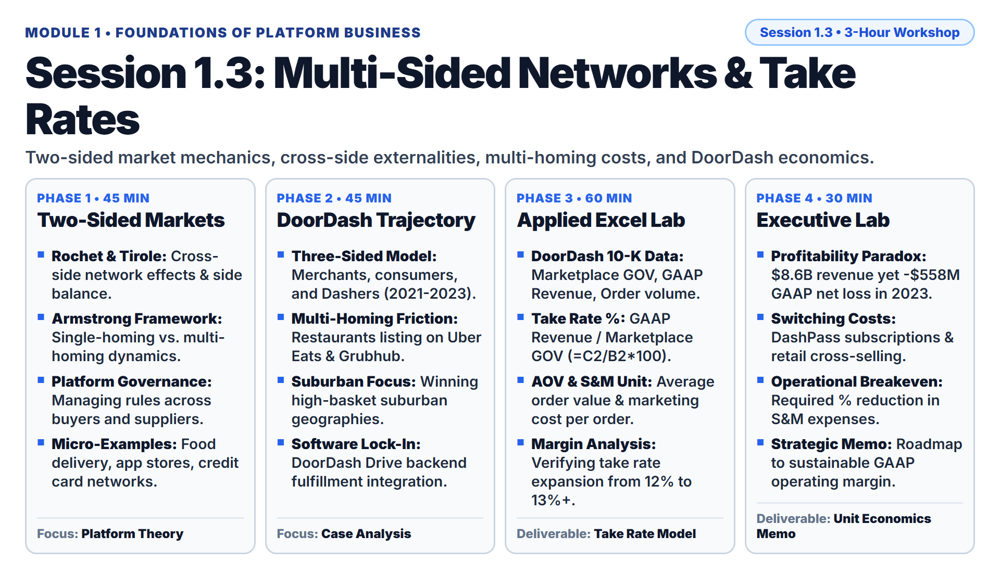

* **Lecture Presentation:** [Download Slides (PDF)](slides/session_1_3_lecture.pdf)

* **Keywords:** Two-Sided Market, Cross-Side Network Effects, Same-Side Network Effects, Multi-Homing, Take Rate, GOV (Gross Order Volume), GAAP (Generally Accepted Accounting Principles).
* **Main Theories:**
  * [Rochet and Tirole (2003, 2006) Platform Competition in Two-Sided Markets](https://en.wikipedia.org/wiki/Two-sided_market#Platform_competition): Jean-Charles Rochet and Jean Tirole (Nobel Laureate 2014). Two-sided platforms must balance pricing across interdependent user groups; volume depends not only on the total price charged, but on how that price is apportioned between the two sides.
  * [Armstrong (2006) Competition in Two-Sided Markets](https://en.wikipedia.org/wiki/Multi-homing): Mark Armstrong. Mathematical framework detailing how multi-homing (users maintaining active accounts on multiple competing platforms) destroys platform pricing power, whereas single-homing on one side creates a "competitive bottleneck" that allows the platform to extract high rents from the other side.
* **Micro-Examples:**
  * On-Demand Food Delivery: Three-sided network coordinating hungry eaters (consumer side), restaurants/merchants (supply side), and couriers (fulfillment logistics side).
  * Smartphone Application Stores: Two-sided ecosystem connecting third-party mobile developers (software side) with smartphone device owners (consumer side).
  * Credit Card Networks: Multi-sided payment infrastructure linking merchant retail stores (accepting terminal fees) with consumer cardholders (enjoying cashback and interest-free grace periods).
* **Real Business Case:**
  * **DoorDash Inc. (2021-2023 Multi-Sided Platform Economics):** DoorDash operates a multi-sided marketplace coordinating consumers, local merchants, and independent delivery couriers ("Dashers"). In dense urban centers, restaurants frequently multi-home by listing menus simultaneously across DoorDash, Uber Eats, and Grubhub, which limits marketplace pricing power. To build a defensible competitive moat, DoorDash expanded aggressively into suburban geographies with larger family basket sizes and launched "DoorDash Drive" (white-label delivery software for merchant websites). By FY2023, DoorDash processed $66.8 billion in Marketplace Gross Order Volume (GOV) across 2.16 billion orders, achieving $8.6 billion in GAAP revenue while managing marketing subsidies to approach operating profitability.
* **Lab Dataset:**
  * File Link: [data/session_1_3_platform_margins.csv](data/session_1_3_platform_margins.csv)
  * Columns: `Fiscal_Year`, `Marketplace_GOV_USD_M` (Marketplace Gross Order Volume in millions of USD), `GAAP_Revenue_USD_M` (Statutory GAAP Revenue in millions of USD), `Total_Orders_M` (Total completed orders in millions), `Cost_of_Revenue_USD_M`, `Sales_Marketing_USD_M`, `GAAP_Net_Loss_USD_M`, `Filing_Source`.
* **Primary Filings & External References:**
  * [DoorDash Inc. Form 10-K Filings (SEC EDGAR CIK 0001792789)](https://www.sec.gov/edgar/browse/?CIK=0001792789)
  * [SEC EDGAR Company Search Database](https://www.sec.gov/edgar/searchedgar/companysearch)
* **Step-by-Step Lab Protocol (Exercise 1: Foundational Practice):**
  * **Step 1: Open the Dataset:** Launch Microsoft Excel. Open [data/session_1_3_platform_margins.csv](data/session_1_3_platform_margins.csv). Confirm that DoorDash operating data for fiscal years 2021, 2022, and 2023 is loaded.
  * **Step 2: Inspect Primary Sources & Financial Terminology:**
    * Regulatory Baseline: Review the `Filing_Source` column (Item 8 of DoorDash Form 10-K).
    * Acronym Expansion: In corporate financial statements, **GOV** stands for **Gross Order Volume** (the total retail dollar value of all merchandise and food purchased across the marketplace, including taxes, delivery fees, and tips, before platform refunds). **GAAP** stands for **Generally Accepted Accounting Principles** (standard statutory legal rules that every US public corporation must follow when reporting revenues and net income). **AOV** stands for **Average Order Value** (the average dollar basket size per transaction).
  * **Step 3: Calculate Platform Take Rate:**
    * Context: Take rate measures the percentage of total gross marketplace transaction volume that the platform retains as recognized corporate revenue.
    * In cell I1, enter the column header `Take_Rate_Pct`.
    * In cell I2, enter the formula: `=(C2/B2)*100` (GAAP Revenue divided by Marketplace GOV, multiplied by 100).
    * Copy the formula down through row 4 (2021 to 2023).
  * **Step 4: Calculate Average Order Value (AOV):**
    * In cell J1, enter the column header `Average_Order_Value_USD`.
    * In cell J2, enter the formula: `=B2/D2` (Marketplace GOV in millions divided by Total Orders in millions).
    * Copy the formula down through row 4. Format as US Currency (`$#,##0.00`).
  * **Step 5: Calculate Marketing Spend per Completed Order:**
    * In cell K1, enter the column header `Marketing_Spend_Per_Order_USD`.
    * In cell K2, enter the formula: `=F2/D2` (Sales and Marketing Expense in millions divided by Total Orders in millions).
    * Copy the formula down through row 4. Format as US Currency (`$#,##0.00`).
  * **Step 6: Interpret Operating Leverage:**
    * Note that while DoorDash expanded its Take Rate from 11.66% in 2021 to 12.92% in 2023, its Marketing Spend per Order dropped from $1.18 to $0.90, proving that increasing brand awareness and consumer habituation yield operational leverage over multi-sided network participants.
* **Step-by-Step Strategic Decision Challenge (Exercise 2+: Advanced Problem Solving):**
  * **Strategic Problem:** Despite generating $8.635 billion in revenue and processing $66.8 billion in transactions in 2023, DoorDash still recorded a statutory GAAP Net Loss of -$558 million. Because consumers and restaurants can multi-home at near-zero friction, platforms are forced into ongoing marketing incentives and driver pay guarantees.
  * **Student Task:**
    1. Using your spreadsheet model, calculate the exact dollar reduction in Sales and Marketing expenses (`Column F`) DoorDash would have required in FY2023 to eliminate its -$558 million GAAP Net Loss and reach operational break-even.
    2. Analyze the operational vulnerability of two-sided food delivery platforms: if DoorDash unilaterally increases merchant commission fees from 15% to 25%, evaluate how restaurants respond via multi-homing or passing fees to consumers.
    3. Draft a structured, three-bullet decision brief addressed to DoorDash's Chief Executive Officer: Formulate an actionable strategic roadmap detailing three proprietary software initiatives (such as DashPass subscription locking, point-of-sale hardware integration, or advertising auction tools) that increase multi-homing switching costs for restaurants and eaters.

---

### Session 1.4: Scale Dynamics & Winner-Takes-All Markets

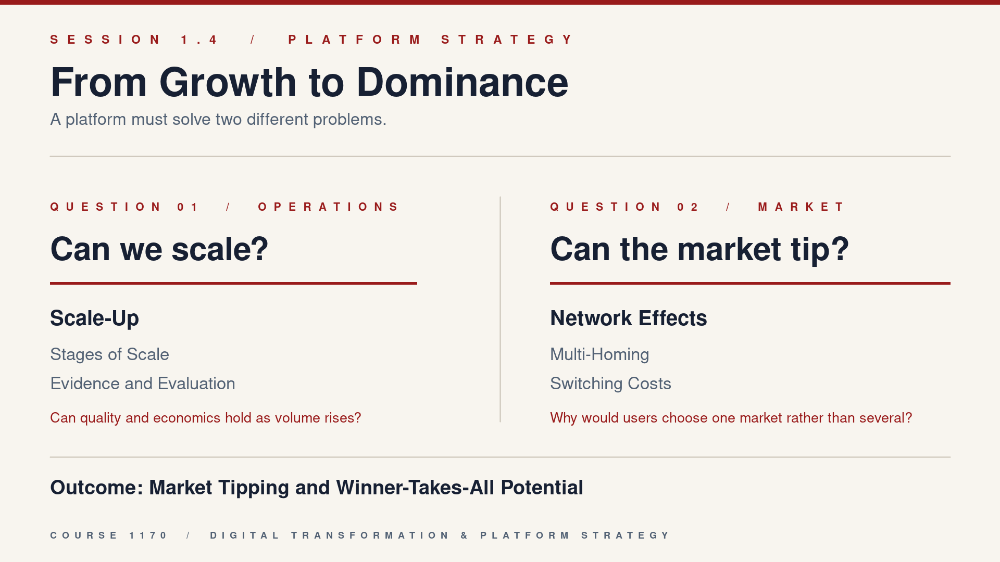

* **Lecture Presentation:** [Download Slides (PDF)](slides/session_1_4_lecture.pdf)

* **Session Challenge:** A startup's graph can rise while its service, team, or supply base cannot keep up. Decide whether growth can become scalable value, then determine whether that value can make one platform the market's preferred place to meet.

* **Keywords:** Scale Dynamics, Winner-Takes-All (WTA), Market Tipping, Switching Costs, Homogeneous Demand, Multi-Homing Costs, and Cross-Side Network Effects.
* **Main Theories:**
  * [W. Brian Arthur (1989) Competing Technologies, Increasing Returns, and Lock-In by Historical Events](https://en.wikipedia.org/wiki/Path_dependence) ([Economic Lock-In](https://en.wikipedia.org/wiki/Vendor_lock-in)): **Scale dynamics** means that a larger user base can make a platform better, which attracts still more users. Think of a busy marketplace: more sellers create more choice, and more buyers make the marketplace worth joining for sellers.
  * [Eisenmann, Parker, and Van Alstyne (2006) Strategies for Two-Sided Markets](https://hbr.org/2006/10/strategies-for-two-sided-markets) ([Winner-Takes-All Market Conditions](https://en.wikipedia.org/wiki/Winner-take-all_market)): A market is more likely to **tip** toward one winner when users get much more value from the largest network, find it costly to use several alternatives, and do not need sharply different products. A market can stay competitive when users can easily use several apps at once.
* **Easy Concept Check: Read the Illustration from Left to Right:**
  * **Scale dynamics, left panel:** The founder sees a rising user chart, but also a limited operations team and a queue. Scale is not simply "more users." It is the ability to serve more users without quality, speed, trust, or unit economics collapsing.
  * **Network effect, center panel:** More buyers and sellers join the central market because each additional participant makes it easier to find a better match. This is a reinforcing loop: more choice attracts demand, and more demand attracts supply.
  * **Winner-takes-all, right panel:** A market tips only when the central platform becomes meaningfully better than alternatives. The two smaller platforms still exist because users can sometimes use more than one service.
  * **Multi-homing and switching cost:** Multi-homing means using several platforms at once. A switching cost is a real loss from leaving, such as trusted reviews, transaction history, workflows, or integrations. The strategic question is whether users stay because the service is better, not because leaving is unfairly difficult.
  * **Winner-takes-all test:** Ask three questions: Can the business serve growth without harming quality? Does each added user improve the experience for others? Is there a meaningful reason to stay after discounts disappear?
* **Core Concept 1: What Does Scale-Up Mean?**
  * **Definition:** A business has begun to scale up when it can increase customers, transactions, or revenue faster than it increases the people, capital, and manual work required to deliver a good experience. Growth is a volume outcome. Scale-up is a repeatable operating capability.
  * **Do not confuse scale-up with growth:** A food-delivery platform that doubles orders by doubling discounts and support staff has grown, but may not have scaled. A platform that doubles completed orders while maintaining delivery time, dispute rates, and contribution per order is closer to scale-up.
  * **Unit economics:** Unit economics asks whether one additional transaction creates enough value to cover the direct cost of serving it. For a marketplace, examine revenue per completed transaction, payment-processing cost, customer-support cost, fraud loss, and any delivery or fulfilment cost. A platform cannot scale sustainably if every additional transaction increases its loss.
* **Core Concept 2: The Four Scale-Up Stages:**
  * **Stage 1 - Problem-solution fit**
    * **Meaning:** A specific user group repeatedly uses the product because it solves a real problem.
    * **How to check:** Do users return without a new discount, recommend the product, or describe a clear alternative they would lose without it?
    * **Easy example:** Students use a campus resale service again because it finds a buyer faster and feels safer than posting in a general chat group.
    * **Do not mistake:** One download or one promotional purchase is not evidence of problem-solution fit.
  * **Stage 2 - Repeatable match**
    * **Meaning:** The platform reliably creates a useful interaction between its two user sides.
    * **How to check:** Observe match rate, time to first match, completion rate, cancellation rate, and whether both sides return.
    * **Easy example:** A student marketplace has repeatable match when buyers regularly find an item and sellers regularly complete a sale, rather than merely collecting many inactive listings.
  * **Stage 3 - Operational replication**
    * **Meaning:** The platform can serve a second campus, city, category, or customer segment without rebuilding its process from zero.
    * **How to check:** Compare the first and second launch location for onboarding time, support workload, service quality, and direct cost per completed transaction.
    * **Easy example:** After a resale marketplace works at one campus, the same identity-check and payment process works at a second campus with only local partner onboarding, not a new manual process for every sale.
  * **Stage 4 - Compounding advantage**
    * **Meaning:** Growth improves the service itself through data, reputation, complements, or network density.
    * **How to check:** Look for a mechanism where each additional active participant improves match quality, trust, selection, or speed for someone else.
    * **Easy example:** As more verified buyers and sellers join one campus marketplace, students find relevant listings faster and sellers receive more credible demand. More activity therefore improves the next user's experience.
  * **Important sequence:** A platform may have Stage 1 without Stage 2, or Stage 3 without Stage 4. Do not assume that a large user number proves the later stages.
* **Core Concept 3: The Scale-Up Evaluation Scorecard:**
  * **Demand quality:** Are users returning and completing transactions without large repeated discounts? Look for repeat use, completed transactions, and referrals. **Example:** score `1` if users appear only during a coupon campaign; score `3` if a defined student group returns; score `5` if repeated use remains strong after promotions end.
  * **Capacity and quality:** Can the platform handle more activity while protecting response time, reliability, trust, and customer support? Look for match time, cancellation rate, dispute rate, and service response time. **Example:** score `1` if each new transaction creates a longer support queue; score `3` if the service works at one location; score `5` if quality remains stable in additional locations.
  * **Unit economics:** Does the contribution from each additional completed transaction exceed the direct cost of serving it? Look for revenue per transaction, direct service cost, and contribution per transaction. **Example:** score `1` if every sale requires more support or subsidy than it earns; score `3` if one category can cover its direct cost; score `5` if the economics remain positive as the platform expands.
  * **Network density:** Are the right users concentrated enough to find each other quickly? Look for active buyers and sellers in the same market, match rate, and time to first successful match. **Example:** score `1` if a buyer sees few relevant listings; score `3` if one campus has enough activity for frequent matches; score `5` if density creates faster matching and better selection as participation grows.
  * **Defensibility:** Does the platform create superior value that is hard to recreate quickly? Look for multi-homing rate, retention after promotions end, repeat use of integrations, and partner loyalty. **Example:** score `1` if users can move to a similar app without losing anything; score `3` if some users value verified reviews or saved history; score `5` if several valuable relationships, workflows, or complements make the leading platform clearly better.
  * **Scoring rule:** Give each dimension a score from `1` to `5`: `1` means no evidence or a serious weakness; `3` means the mechanism works in one limited setting; `5` means it is repeatable and supported by clear evidence. The score exposes assumptions. It is not a substitute for judgment.
* **Worked Example: How to Diagnose One Platform:**
  * **Campus resale marketplace:** Students return because secure payments and verified identities reduce the risk of being scammed. This is evidence for problem-solution fit, not yet proof of scale-up.
  * **Stage decision:** If buyers usually find an item, sellers complete a sale, and both sides return, the platform has evidence of a repeatable match. If the same trust process works at a second campus without a new manual team, it has evidence of operational replication.
  * **Scorecard example:** A new marketplace may score `3` for demand quality, `2` for capacity and quality, `2` for unit economics, `2` for network density, and `1` for defensibility. The weak scores indicate that the founder should first concentrate activity at one campus and improve reliable matching, rather than spend immediately on five-campus growth.
  * **Winner-takes-all decision:** It may later tip if verified reputation and transaction safety improve as more local students join. It is likely to remain contested if sellers can list in other groups at no cost and buyers do not value the platform's additional trust features.
* **Micro-Application Cards for the First 60 Minutes:**
  * **How to use the cards:** Students work alone for eight minutes. For each card, they write one short answer using the named concept and one cited fact from the card. These are reasoning checks, not calculations.
  * **Card 1 - Growth or scale-up?** A campus marketplace grows from `100` to `1,000` registered users in one month after a referral campaign. Customer-support replies slow from one day to five days, and there is no evidence that new users complete transactions. **Student prompt:** Is this growth, scale-up, or insufficient evidence? Name one operating measure that must improve before you call it scale-up.
  * **Card 2 - Which stage is supported?** A student marketplace has three observations: `A` - many students download the app using a discount but rarely return; `B` - buyers and sellers complete exchanges every week and both sides return; `C` - a second campus uses the same identity-check and payment process with similar completion rates. **Student prompt:** Label `A`, `B`, and `C` with the highest scale-up stage supported. Explain why `A` is not evidence of a repeatable match.
  * **Card 3 - Score network density.** At one campus, `60` buyers open the marketplace each week but only `8` sellers list items. Most buyers see fewer than two relevant listings, and a successful match takes about six days. **Student prompt:** Give network density a score from `1` to `5`. What one action could improve the score without expanding to another campus?
  * **Card 4 - Will the market tip?** Use the illustration's central marketplace and smaller alternatives. **Student prompt:** What feature would make buyers and sellers choose the central market? What would make them continue using several markets instead?
  * **Instructor debrief:** Card 1 shows growth but not scale-up. Card 2 supports no confirmed stage for `A`, repeatable match for `B`, and operational replication for `C`. Card 3 is likely a `2`: activity exists, but supply is too thin for reliable matching. Card 4 should identify a user benefit such as trusted reputation or faster matching, and a multi-homing route such as zero-cost cross-listing.
* **Core Concept 4: When Can Scale-Up Become Winner-Takes-All?**
  * **What market tipping means:** Market tipping occurs when most users increasingly choose one leading platform because it is clearly more useful. It does not mean that every rival disappears. The question is whether users gain enough extra value from the leading network to prefer it over using several alternatives.
  * Scale-up becomes a winner-takes-all opportunity only when a larger network gives users a clearly better experience and rivals cannot easily reproduce that advantage.
  * The four conditions are: strong cross-side network effects, enough local density to improve matching, meaningful but fair switching costs, and limited need for differentiated alternatives.
  * If users can multi-home at low cost, or if each city, category, or user segment needs a different product, the likely outcome is a competitive multi-platform market rather than one winner.
* **Success Cases: Scale Became a Durable Advantage:**
  * **Case 1: Google Search.** As users made more queries, Google could refine search relevance; reliable relevance attracted more searches and advertisers. The lesson is not merely that Google grew. It is that the core service could improve as usage grew, creating a reinforcing feedback loop.
  * **Case 2: Microsoft Windows and its software ecosystem.** More organizations using Windows attracted more developers. More compatible software then made Windows more useful for organizations. The lesson is that scalable growth can come from an ecosystem of complements, not only from the focal product.
* **Failure Cases: Scale Did Not Create a Single Winner:**
  * **Case 3: Uber China vs. Didi (2014-2016).** Both firms could add riders and drivers through discounts, but riders and drivers could compare more than one app. The lesson is that growth purchased with incentives does not become winner-takes-all if a rival can offer a similar match tomorrow.
  * **Case 4: Clubhouse and social-audio competitors.** Early attention created rapid growth, but creators and listeners could maintain audiences across competing services, while rivals could add similar features. The lesson is that a growing community does not automatically create a durable market tip.
* **Pre-Exercise Bridge: Diagnose a Contested Case Before Exercise 1:**
  * **Uber China-Didi with the instructor:** Students first underline the evidence of multi-homing: riders compare fares across apps and drivers receive work from more than one platform. They then name one scorecard condition that incentives can improve temporarily and one condition that incentives cannot solve.
  * **Clubhouse individually:** Students write: "The weakest condition is ______ because ______." They select `network effects`, `defensibility`, `operational replication`, or more than one, then cite the relevant evidence. This uses the same evidence → condition → explanation sequence required in Exercise 1.
* **Four-Case Evidence Cards: Use These Inputs for Exercise 1:**
  * **Google Search:** Search is delivered as software rather than through a human service team for each query. Search queries and user interactions can provide signals that improve result relevance. Users can try alternative search engines, but a reliably useful result experience gives them a reason to return. **Diagnosis prompt:** Which evidence supports compounding advantage, and what evidence about cost per additional search would you still need before assigning a `5` for unit economics?
  * **Microsoft Windows:** Organizations use Windows with compatible business applications, trained employees, and established information-technology processes. More developers can create compatible applications when a large installed base exists. Moving to another operating system can require retraining and software migration. **Diagnosis prompt:** Is the ecosystem evidence of operational replication, compounding advantage, or both? What makes the switching cost a user benefit rather than a barrier alone?
  * **Uber China-Didi:** Both platforms added riders and drivers through price incentives. Riders could compare fares and wait times across apps, and drivers could receive work from more than one platform. Reliable matching still required local supply and demand in each city. **Diagnosis prompt:** Which scorecard dimensions can subsidies improve temporarily, and which dimensions do they leave unresolved?
  * **Clubhouse:** The service attracted early attention around live social audio, but creators could build audiences on several services and competing platforms could add similar live-audio features. The value of a specific room depended on which hosts and listeners joined at that time. **Diagnosis prompt:** Does this show a weak network effect, weak defensibility, insufficient operational replication, or a combination? Identify the evidence before deciding.
* **Individual Strategy Workbook:**
  * File Link: [data/session_1_4_platform_strategy_workbook.csv](data/session_1_4_platform_strategy_workbook.csv)
  * Columns: `Student_Name`, `Scenario_Selected`, `User_Side_A`, `User_Side_B`, `Scale_Stage_Observed`, `Demand_Quality_Score_1_to_5`, `Capacity_Quality_Score_1_to_5`, `Unit_Economics_Score_1_to_5`, `Network_Density_Score_1_to_5`, `Defensibility_Score_1_to_5`, `Strategy_Chosen`, `First_90_Day_Action`, `Success_Metric`, `Presentation_Claim`.
* **Primary Filings & External References:**
  * [Uber Technologies, Inc. SEC Filings](https://www.sec.gov/edgar/browse/?CIK=0001543151)
  * [StatCounter Global Search Engine & Mobile Operating System Market Statistics](https://gs.statcounter.com/search-engine-market-share)
* **Class Rhythm: Concept-Application Cycles + Strategy Studio:**
  * **0-15 minutes - Scale-Up Definition:** The instructor distinguishes simple growth from scale-up: growth adds volume, while scale-up preserves customer value and operating quality as volume rises. **Micro-application:** Students use Card 1 to decide whether the evidence shows growth, scale-up, or insufficient evidence.
  * **15-30 minutes - Four Scale-Up Stages:** The instructor explains problem-solution fit, repeatable match, operational replication, and compounding advantage using the campus resale example. **Micro-application:** Students use Card 2 to label the highest stage supported by each observation, then compare their answer with the stage definitions before the instructor debrief.
  * **30-45 minutes - Scale-Up Evaluation Scorecard:** The instructor explains demand quality, capacity and quality, unit economics, network density, and defensibility, including the `1`, `3`, and `5` score anchors. **Micro-application:** Students use Card 3 to score network density, state one reason, and identify an action that would improve the score.
  * **45-60 minutes - Winner-Takes-All Conditions:** The instructor explains market tipping, multi-homing, and fair switching costs through the illustration. **Micro-application:** Students use Card 4 to identify one mechanism that could cause tipping and one mechanism that would keep the market contested.
  * **60-110 minutes - Four-Case Diagnosis:** Students use the Evidence Cards and Scorecard to diagnose Google Search, Microsoft Windows, Uber China-Didi, and Clubhouse. This is Exercise 1.
  * **110-180 minutes - Strategy Choice and Presentation:** Each student chooses Scenario A or Scenario B, builds a strategy around the weakest scale-up condition, defines a success metric, and gives a three-minute presentation. This is Exercise 2.
* **Step-by-Step Lab Protocol (Exercise 1: Four-Case Diagnosis, 50 Minutes):**
  * **Step 1: Create a Case Grid:** In a notebook or spreadsheet, make four rows named `Google Search`, `Microsoft Windows`, `Uber China-Didi`, and `Clubhouse`. Copy the relevant facts from the Four-Case Evidence Cards into each row. You are not expected to research facts outside the provided cards.
  * **Step 2: Identify the Scale Stage:** For each case, label the highest observable stage from `Problem-solution fit`, `Repeatable match`, `Operational replication`, or `Compounding advantage`. Write one sentence explaining the evidence.
  * **Step 3: Score the Scale-Up Conditions:** Give each case a `1` to `5` score for demand quality, capacity and quality, unit economics, network density, and defensibility. Use the score anchors above. Mark one score as `Insufficient evidence` when the Evidence Card does not support a defensible number, then state the information you would need.
  * **Step 4: Identify the Tipping Question:** Write one sentence answering: "When one more user joined, whose experience became better, and could that user also use a rival?"
  * **Step 5: Make the Verdict:** Label each case `Scalable and likely to tip`, `Scalable but likely contested`, or `Growth without durable advantage`. Support the label with one scale-dynamics observation and one multi-homing or switching-cost observation.
  * **Step 6: Compare the Four Cases:** Write a 100-word conclusion explaining why a rising growth curve alone is neither proof of scalable operations nor proof of a winner-takes-all market.
* **Individual Applied Practice (Exercise 2: Choose a Strategy and Present It, 70 Minutes):**
  * **Scenario A: Campus resale marketplace.** Your university has a popular informal resale group, but students report scams, missed meet-ups, and low-quality listings. You can use the launch budget to enter five campuses quickly with referral discounts, or launch at one campus with verified identity, secure payments, and reliable meet-up locations. Choose one strategy. Explain whether you are solving a scale problem, a market-tipping problem, or both.
  * **Scenario B: Student project-workspace.** Students coordinate group work through chat, cloud storage, calendars, and generative artificial intelligence tools. You can offer a lower price and recruit individual users widely, or work with three large courses to integrate project history, instructor feedback, deadlines, and team tasks in one workflow. Choose one strategy. Explain how the strategy makes the product scale without making student exit unfairly difficult.
  * **Step 1: Select One Scenario:** In the workbook, enter `Scenario A` or `Scenario B` in cell `B2`. Identify the two user sides in cells `C2` and `D2`.
  * **Step 2: Score the Current Position:** In cells `E2` through `J2`, enter the current stage and the five `1` to `5` scorecard ratings. Add a short note beside your workbook explaining the lowest score.
  * **Step 3: Build Your Strategy:** In cells `K2` and `L2`, state your chosen strategy and the first action to complete within 90 days. The action must improve the lowest score without damaging another score.
  * **Step 4: Define a Success Metric:** In cell `M2`, choose one measurable signal that tests your scale claim, such as dispute-free exchanges, matching time, repeat transactions, active project teams, or weekly return use.
  * **Step 5: Present Your Decision:** Deliver a 3-minute individual presentation with three slides or one visual page: `The weakest scale-up condition`, `why this market may or may not tip`, and `the strategy and metric that would make me change my mind`.
* **Debrief Standard:** A strong presentation makes a clear strategic choice, separates scalable operations from market tipping, recognizes multi-homing risk, and names measurable evidence that could disprove the recommendation.

---

## Module 2: Platform Economics, Big Data & Monetization

### Session 2.1: Big Data & Digital Asset Utilization: From Signals to Better Decisions

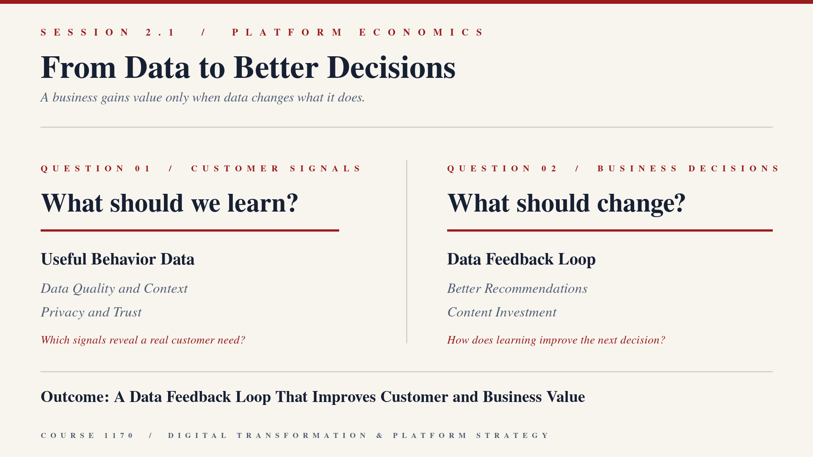

* **Lecture Presentation:** [Download Slides (PDF)](slides/session_2_1_lecture.pdf)

* **Keywords:** Data Feedback Loop, Algorithmic Curation, Data Quality, CAC (Customer Acquisition Cost), LTV (Customer Lifetime Value), Churn Rate, ARPU (Average Revenue Per User or Member).
* **Main Theories:**
  * [Andrei Hagiu and Julian Wright (2020) When Data Creates Competitive Advantage](https://hbr.org/2020/01/when-data-creates-competitive-advantage): Harvard Business Review. Demonstrates that data is rarely a defensible barrier on its own; data creates a true competitive moat only when customer usage data immediately and autonomously feeds back into product improvements faster than competitors can copy (the data feedback loop).
  * [Information Asymmetry, Signaling & Screening](https://en.wikipedia.org/wiki/Information_asymmetry): [George A. Akerlof (1970) The Market for Lemons](https://en.wikipedia.org/wiki/The_Market_for_Lemons) and [Joseph E. Stiglitz (1975) The Theory of Screening](https://en.wikipedia.org/wiki/Screening_(economics)). How digital platforms utilize longitudinal customer interaction datasets and user reputation scoring algorithms to eliminate uncertainty, lower counterparty risk, and intermediate markets that previously suffered from market failure.
* **Session Challenge:**

  

  A streaming service can observe what viewers start, finish, pause, and save. Which signals reveal a useful customer need, and what business decision should change because of them?
* **Core Concept 1: Data is not automatically a business asset:** A data point is a recorded fact, such as a viewer pausing a video. It becomes useful only when it helps answer a business question and changes an action. A high number of clicks is not automatically good news: the clicks may show curiosity, confusion, or a search failure. Start with the decision, then identify the smallest set of signals that could improve it.
  * **Worked Example:** A viewer watches a cooking video to the end, saves it, and then searches for beginner recipes. The useful signal is not only watch time. The sequence suggests that the viewer may value a beginner cooking recommendation.
  * **Micro-Application 1 - Signal or noise?:** A music app records three events: a user opens a song for two seconds, saves a song to a playlist, and listens to an entire album twice. Individually choose the one event that gives the strongest evidence of preference and write one sentence explaining why.
* **Core Concept 2: A data feedback loop turns learning into a better next action:** The loop has five steps: collect a signal, interpret it, choose an action, observe the result, and learn again. In plain language, a platform learns only if the next recommendation, design choice, or investment is better because of the signal. More data without a changed decision is storage, not advantage.
  * **Worked Example:** Netflix can observe that viewers who finish a Korean thriller also start similar titles. It tests a new recommendation row, observes whether those viewers watch more of the suggested titles, and retains or changes the row based on the result.
  * **Micro-Application 2 - Complete the loop:** A campus events app sees that students save events but do not attend. Individually complete this sentence: "The app should test ______ because the saved-event signal may mean ______. I would observe ______ to decide whether the test worked."
* **Core Concept 3: Data quality, context, and trust set the limit:** Good data is relevant to the decision, accurate enough to use, and interpreted in context. A platform must also earn permission to collect and use it. Privacy and trust are business conditions: if users do not understand or accept the data practice, they may leave, provide less reliable information, or damage the brand.
  * **Worked Example:** A streaming service sees a video stop after ten seconds. Without context, it cannot assume dislike. The viewer may have received a phone call, had a slow connection, or found the content irrelevant. A good decision needs more evidence than one click.
  * **Micro-Application 3 - What is missing?:** A food-delivery app wants to conclude that a customer dislikes a restaurant because the customer closed its menu. Name one alternative explanation and one additional signal the app should check before changing the recommendation.
* **Core Concept 4: Customer economics tell managers whether the loop creates business value:** CAC is the sales and marketing cost needed to acquire one paying customer. LTV is the gross profit expected from that customer before the customer leaves. Churn Rate is the percentage of paying customers who cancel in a period. ARPU is average revenue earned from each active customer or member. These metrics do not prove that a recommendation is good by themselves. They show whether a better customer experience is also improving the economics.
  * **Micro-Application 4 - Which metric matters first?:** A streaming service improves recommendations. It wants to know whether the change keeps subscribers. Choose one first metric: new sign-ups, churn rate, or office rent. Explain your choice in one sentence.
* **Micro-Examples:**
  * Streaming Recommendations: A viewer's completed shows, saves, and searches can help a streaming service test more relevant next-title recommendations.
  * Store Search: A shopper's search, filters, and completed purchase can help an online store improve search results, but a short click alone may not reveal intent.
  * Campus Events: Saved events, attendance, and repeat attendance can help a campus app decide which events to promote, if students understand and accept the data use.
* **Real Business Case:**
  * **Netflix Inc. (2019-2023 Data-Informed Content Decisions):** Netflix shifted from licensing third-party catalogues toward funding original content. Its viewing data can help managers test recommendations and understand demand patterns, but data does not guarantee a successful show. Students use the audited dataset to observe the relationship among content cash spending, memberships, revenue, and operating income. They must distinguish an observed financial pattern from a claim that data caused it.
* **Lab Dataset:**
  * File Link: [data/session_2_1_content_data.csv](data/session_2_1_content_data.csv)
  * Columns: `Fiscal_Year`, `Revenue_USD_M` (Statutory Revenue in millions of USD), `Additions_To_Content_Assets_Cash_USD_M` (Cash spent on streaming content in millions of USD), `Amortization_Content_Assets_USD_M` (Amortization expense in millions of USD), `Paid_Memberships_End_Of_Year_M` (Ending paid memberships in millions), `Operating_Income_USD_M`, `Filing_Source`.
* **Primary Filings & External References:**
  * [Netflix Inc. Form 10-K Filings (SEC EDGAR CIK 0001065280)](https://www.sec.gov/edgar/browse/?CIK=0001065280)
  * [When Data Creates Competitive Advantage (Harvard Business Review)](https://hbr.org/2020/01/when-data-creates-competitive-advantage)
* **Step-by-Step Lab Protocol (Exercise 1: Guided-to-Independent Data Diagnosis, 50 Minutes):**
  * **Step 1: Open the Dataset:** Launch Microsoft Excel. Open [data/session_2_1_content_data.csv](data/session_2_1_content_data.csv). Read the `Filing_Source` column and confirm that each row covers Netflix FY2019 to FY2023.
  * **Step 2: Build the Language Bridge:** In your notebook, write: Cash content additions means cash spent to add streaming content. Amortization means the accounting expense recognized from content already available. ARPU means annual revenue divided by paid memberships. Do not treat any of these measures as direct evidence of viewer satisfaction.
  * **Step 3: Work One Year with the Instructor:** In cell `H1`, enter `Content_Cash_as_Pct_Revenue`. In cell `H2`, enter `=(C2/B2)*100`. In cell `I1`, enter `Annual_Revenue_Per_Member_USD`. In cell `I2`, enter `=(B2*1000000)/(E2*1000000)`. State what each result measures in plain language before copying a formula.
  * **Step 4: Complete the Remaining Years Individually:** Copy formulas in `H2:I2` down through row `6`. Format column `H` as Percentage and column `I` as US Currency (`$#,##0.00`).
  * **Step 5: Separate Evidence from Claim:** Write three sentences: one observed change in the data, one business question the change raises, and one additional customer-behavior measure needed before claiming that a data feedback loop caused the outcome.
  * **Step 6: Compare with a Partner:** Read your three sentences aloud. Revise any sentence that confuses a financial outcome with proof of a customer-data mechanism.
* **Step-by-Step Strategic Decision Challenge (Exercise 2: Individual Data Strategy Presentation, 70 Minutes):**
  * **Strategic Problem:** StreamWise is a new student streaming platform. It can either collect every click and sell detailed audience profiles to advertisers, or request clear permission to collect a smaller set of viewing, saving, and search signals that improve recommendations and content decisions. Management needs growth, but students must trust the service.
  * **Workbook:** Open [data/session_2_1_data_strategy_workbook.csv](data/session_2_1_data_strategy_workbook.csv). Save a personal copy before entering your strategy.
  * **Step 1: Choose a Strategy:** Choose one of the two approaches, or design a third approach. State your choice in one sentence: `My strategy is ______ because ______.`
  * **Step 2: Build the Feedback Loop:** Identify one signal to collect, the decision it will change, the customer outcome you expect, and the result you will measure. Explain why the signal is better than a simple click count.
  * **Step 3: Name the Weakest Condition:** Identify the greatest risk: weak data quality, weak customer trust, an unclear business decision, or poor economics. State one 90-day action that addresses it.
  * **Step 4: Set the Decision Rule:** Choose one metric or additional evidence that would make you change your recommendation. Explain why it matters.
  * **Step 5: Rehearse and Present Individually:** Take one minute to rehearse with these sentence starters: `My strategy is ...`; `The evidence I need is ...`; `The greatest risk is ...`; `In 90 days, I would ...`; `I would change my decision if ...`. Deliver a 3-minute individual presentation using the same five parts.
* **Debrief Standard:** A strong presentation distinguishes data collection from data value, names a complete feedback loop, protects customer trust, and uses an observable metric rather than an unsupported claim.

---

### Session 2.2: Platform Pricing Strategies I: Subsidies & Asymmetric Pricing

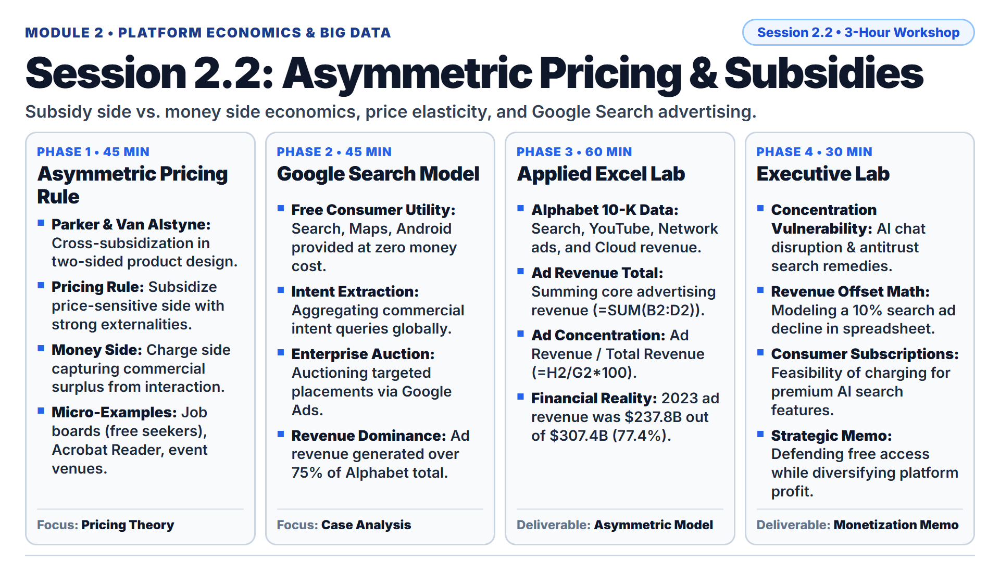

* **Lecture Presentation:** [Download Slides (PDF)](slides/session_2_2_lecture.pdf)

* **Keywords:** Asymmetric Pricing, Subsidy Side, Money Side, Cross-Subsidization, Price Elasticity, Ad-Supported Monetization.
* **Main Theories:**
  * [Geoffrey G. Parker and Marshall W. Van Alstyne (2005) Two-Sided Network Effects: A Theory of Information Product Design](https://en.wikipedia.org/wiki/Two-sided_market): Management Science. Mathematical foundation proving that platforms should price below marginal cost (or even give products away for free) on the market side that creates strong positive cross-side network externalities, recovering profits by charging a premium to the less price-sensitive "money side".
  * [The Asymmetric Pricing Rule in Platform Economics](https://en.wikipedia.org/wiki/Two-sided_market#Pricing_strategy): Subsidize the side that has higher price elasticity and generates positive spillover benefits; monetize the side that captures commercial value from participating in the interaction.
* **Micro-Examples:**
  * Professional Employment Platforms: LinkedIn and Indeed provide free resume hosting, profile creation, and job search applications to millions of individual professionals (the subsidy side), while charging corporate HR recruiters and headhunters thousands of dollars annually for candidate search software (the money side).
  * Digital Publishing and Document Tools: Adobe distributes Adobe Acrobat Reader completely free to create a universal global document standard, while monetizing enterprise document creators who purchase Adobe Acrobat Pro software licenses.
  * Real Estate Marketplaces: Zillow provides completely free home valuation data and property browsing to millions of prospective homebuyers, while monetizing real estate agents who pay premium fees for buyer leads and premier agent placement.
* **Real Business Case:**
  * **Alphabet Inc. / Google (2021-2023 Asymmetric Platform Monetization):** Google delivers premier consumer software utilities (Google Search, Maps, Gmail, YouTube, Android) to billions of daily active users worldwide at zero monetary cost. Consumers pay with their time, attention, and high-intent search queries. Google monetizes this attention on the enterprise side by conducting real-time keyword auctions through Google Ads. In FY2023, advertising revenue generated $237.85 billion (over 77% of Alphabet's $307.39 billion total revenue), demonstrating the power of cross-subsidizing a massive consumer network to extract extraordinary enterprise advertising rents.
* **Lab Dataset:**
  * File Link: [data/session_2_2_pricing_subsidies.csv](data/session_2_2_pricing_subsidies.csv)
  * Columns: `Fiscal_Year`, `Google_Search_Advertising_USD_M`, `YouTube_Advertising_USD_M`, `Google_Network_Advertising_USD_M`, `Subscriptions_Platforms_Devices_USD_M`, `Google_Cloud_USD_M`, `Total_Alphabet_Revenue_USD_M`, `Filing_Source`.
* **Primary Filings & External References:**
  * [Alphabet Inc. Form 10-K Filings (SEC EDGAR CIK 0001652044)](https://www.sec.gov/edgar/browse/?CIK=0001652044)
  * [SEC EDGAR Company Search Database](https://www.sec.gov/edgar/searchedgar/companysearch)
* **Step-by-Step Lab Protocol (Exercise 1: Foundational Practice):**
  * **Step 1: Open the Dataset:** Launch Microsoft Excel. Open [data/session_2_2_pricing_subsidies.csv](data/session_2_2_pricing_subsidies.csv). Confirm audited revenue breakdowns for Alphabet Inc. (FY2021 through FY2023) are loaded.
  * **Step 2: Inspect Primary Sources:** Check the `Filing_Source` column, verifying figures originate directly from Item 8 (Segment Reporting and Net Revenues by Product) of Alphabet's statutory SEC Form 10-K.
  * **Step 3: Calculate Total Consolidated Advertising Revenue:**
    * In cell H1, enter the column header `Total_Advertising_Revenue_USD_M`.
    * In cell H2, enter the formula: `=SUM(B2:D2)` (Google Search + YouTube + Google Network).
    * Copy the formula down through row 4 (2021 to 2023).
  * **Step 4: Calculate Advertising Revenue Concentration:**
    * In cell I1, enter the column header `Ad_Revenue_Pct_Total`.
    * In cell I2, enter the formula: `=(H2/G2)*100` (Total Advertising divided by Total Alphabet Revenue, multiplied by 100).
    * Copy the formula down through row 4.
  * **Step 5: Synthesize Asymmetric Economics:**
    * Verify that in 2023, advertising represented 77.38% of total revenue ($237,855M out of $307,394M).
    * Explain why Google must strictly resist charging consumers even $1 per month for Search: adding any consumer fee would destroy search query volume, degrading the advertiser keyword auction that generates over $230 billion annually.
* **Step-by-Step Strategic Decision Challenge (Exercise 2+: Advanced Problem Solving):**
  * **Strategic Problem:** Extreme reliance on asymmetric advertising monetization exposes platforms to severe structural disruption from generative artificial intelligence (AI) chat interfaces that synthesize answers directly without displaying traditional ten blue search links and sponsored advertisements.
  * **Student Task:**
    1. In your spreadsheet, model a disruptive scenario where generative AI search interfaces cause Google's core Search Advertising revenue (`Column B`) to decline by 15% in FY2024. Calculate the exact dollar loss in revenue.
    2. Determine how many billions of dollars Google Cloud (`Column F`) and Subscriptions/Devices (`Column E`) must expand to completely offset this 15% search advertising revenue decline.
    3. Draft a structured, three-bullet decision brief addressed to Alphabet's Chief Executive Officer: Formulate an actionable executive recommendation on whether Google should introduce a consumer subscription fee for conversational AI search or preserve asymmetric advertising by embedding interactive merchant shopping cards within AI responses.

---

### Session 2.3: Platform Pricing Strategies II: Advanced Monetization Models

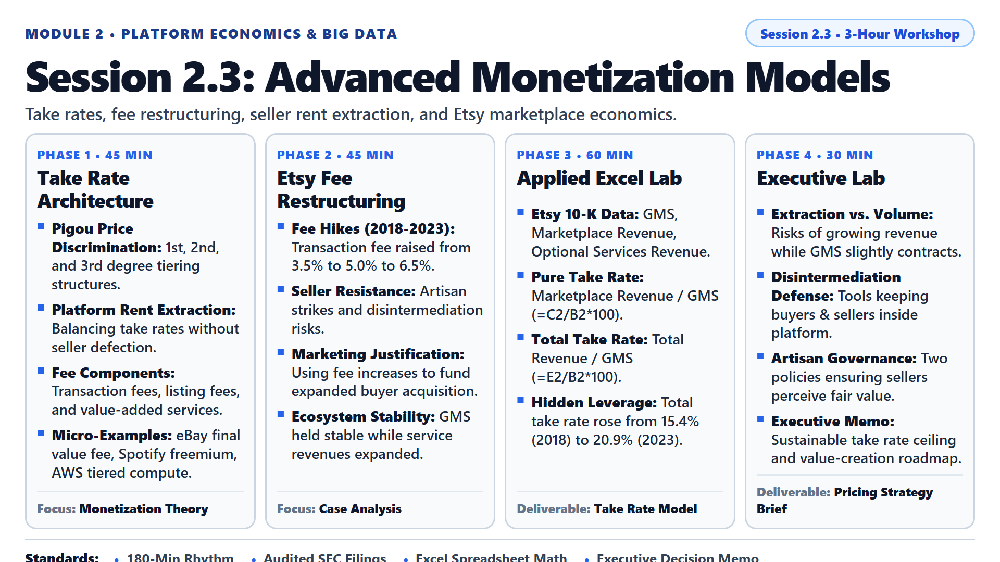

* **Lecture Presentation:** [Download Slides (PDF)](slides/session_2_3_lecture.pdf)

* **Keywords:** Take Rate, Final Value Fee, GMS (Gross Merchandise Sales), Freemium Conversion, Dynamic Pricing, Seller Services.
* **Main Theories:**
  * [Arthur Cecil Pigou (1920) The Economics of Welfare - Price Discrimination Framework](https://en.wikipedia.org/wiki/Price_discrimination): First-degree (personalized individual pricing), second-degree (product versioning, feature tiering, and volume discounting), and third-degree (market segmentation and demographic pricing).
  * [Platform Rent Extraction and Merchant Disintermediation](https://en.wikipedia.org/wiki/Economic_rent): How aggressive platform take rate escalation incentivizes high-volume merchants to defect and complete transactions off-platform (disintermediation), degrading the long-term health of the ecosystem.
* **Micro-Examples:**
  * Online Auction Marketplaces: eBay charges listing insertion fees plus a final value fee (percentage of total transaction value), supplemented by promoted listing advertising fees.
  * Freemium Streaming Subscriptions: Spotify provides an ad-supported free tier with shuffle playback constraints, successfully converting over 40% of its high-engagement users into paying Premium monthly subscribers.
  * Cloud Computing Infrastructure: Amazon Web Services (AWS) utilizes dynamic second-degree price discrimination, charging per gigabyte of data transfer and per second of compute execution with steep volume discount tiers.
* **Real Business Case:**
  * **Etsy Inc. (2018-2023 Take Rate Escalation & Seller Revolt):** In 2018, handcrafted goods marketplace Etsy increased its core marketplace transaction fee from 3.5% to 5.0%. In April 2022, Etsy raised the fee again to 6.5%, prompting over 14,000 artisan sellers to go on a week-long platform strike. Management defended the fee increases by proving that higher revenues funded marketing campaigns that attracted millions of active buyers. Crucially, Etsy layered optional seller services (Etsy Payments, shipping labels, and on-site promoted listings) on top of the base transaction fee. By FY2023, while Gross Merchandise Sales (GMS) plateaued at $13.16 billion, Etsy's total platform revenue grew to $2.75 billion, achieving an effective total take rate of 20.88%.
* **Lab Dataset:**
  * File Link: [data/session_2_3_monetization_take_rates.csv](data/session_2_3_monetization_take_rates.csv)
  * Columns: `Fiscal_Year`, `Gross_Merchandise_Sales_USD_M`, `Marketplace_Revenue_USD_M`, `Services_Revenue_USD_M`, `Total_Revenue_USD_M`, `Official_Transaction_Fee_Pct`, `Filing_Source`.
* **Primary Filings & External References:**
  * [Etsy Inc. Form 10-K Filings (SEC EDGAR CIK 0001370637)](https://www.sec.gov/edgar/browse/?CIK=0001370637)
  * [SEC EDGAR Company Search Database](https://www.sec.gov/edgar/searchedgar/companysearch)
* **Step-by-Step Lab Protocol (Exercise 1: Foundational Practice):**
  * **Step 1: Open the Dataset:** Launch Microsoft Excel. Open [data/session_2_3_monetization_take_rates.csv](data/session_2_3_monetization_take_rates.csv). Verify Etsy financial numbers across fiscal years 2017 through 2023.
  * **Step 2: Inspect Primary Sources & Financial Terminology:**
    * Regulatory Baseline: Review the `Filing_Source` column (Item 8 of Etsy Form 10-K).
    * Acronym Expansion: In e-commerce platform analysis, **GMS** stands for **Gross Merchandise Sales** (the total dollar volume of goods sold by third-party sellers across the marketplace, including shipping fees). **Take Rate** represents the percentage of GMS extracted by the platform as corporate revenue.
  * **Step 3: Calculate Pure Marketplace Take Rate:**
    * In cell H1, enter the column header `Marketplace_Take_Rate_Pct`.
    * In cell H2, enter the formula: `=(C2/B2)*100` (Marketplace Revenue divided by GMS, multiplied by 100).
    * Copy the formula down through row 8 (2017 to 2023).
  * **Step 4: Calculate Total Consolidated Platform Take Rate:**
    * In cell I1, enter the column header `Total_Take_Rate_Pct`.
    * In cell I2, enter the formula: `=(E2/B2)*100` (Total Revenue divided by GMS, multiplied by 100).
    * Copy the formula down through row 8.
  * **Step 5: Contrast Stated Fee vs. Effective Take Rate:**
    * Observe that while Etsy's official stated transaction fee was 5.0% in 2021 and 6.5% in 2023, its Total Take Rate reached 17.26% in 2021 and 20.88% in 2023.
    * Conclude how platform owners capture massive economic rents through optional ancillary merchant services (advertising, payment processing, fulfillment) without raising base listing fees.
* **Step-by-Step Strategic Decision Challenge (Exercise 2+: Advanced Problem Solving):**
  * **Strategic Problem:** Driving corporate revenue growth by escalating take rates rather than expanding underlying transaction volume creates severe platform fragility. Between 2021 and 2023, Etsy's GMS declined from $13.49B to $13.16B while Total Revenue expanded by $419M, indicating aggressive monetization extraction during stagnant volume growth.
  * **Student Task:**
    1. Using your spreadsheet calculations, calculate the exact spread between Etsy's Total Take Rate (`Column I`) and its Official Transaction Fee (`Column F`) in FY2023. What does this spread reveal about seller dependency on promoted advertising?
    2. Explain the strategic risk of merchant disintermediation: how high can take rates rise before artisan sellers migrate to independent Shopify storefronts or direct social media channels?
    3. Draft a structured, three-bullet decision brief addressed to Etsy's Chief Executive Officer: Formulate an actionable platform governance policy establishing clear boundaries on merchant monetization, ensuring sellers receive demonstrable value in return for paying a 20%+ effective take rate.

---

### Session 2.4: Midterm Strategy Review & Project Milestone

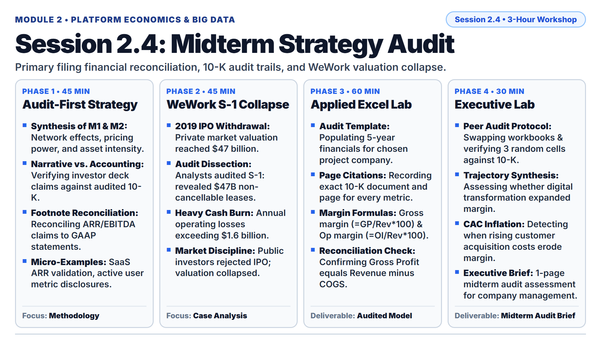

* **Lecture Presentation:** [Download Slides (PDF)](slides/session_2_4_lecture.pdf)

* **Keywords:** Term Project, Financial Reconciliation, Primary Filings, 10-K, Audit Trail, Platform Mapping, ARR (Annual Recurring Revenue), COGS (Cost of Goods Sold), S&M (Sales and Marketing), R&D (Research and Development), IPO (Initial Public Offering).
* **Main Theories:**
  * [Multi-Dimensional Platform Strategy Synthesis](https://en.wikipedia.org/wiki/Platform_economy): Holistically reconciling network dynamics, multi-homing barriers, asset intensity, and take rate sustainability across Modules 1 and 2.
  * [Statutory Disclosure Integrity and Financial Statement Verification](https://en.wikipedia.org/wiki/Financial_statement_analysis): Cross-examining executive promotional claims (press releases, investor day pitch decks) against legally audited regulatory filings (SEC Form 10-K and Form 20-F) to detect accounting distortions.
* **Micro-Examples:**
  * Fact-Checking Investor Decks: Comparing a startup's pitch deck claiming $50 million in "Annual Recurring Revenue (ARR)" against its statutory Form S-1 registration statement showing GAAP revenue of only $28 million due to customer churn.
  * Metric Footnote Discrepancies: Investigating how a social media platform reports 100 million "Registered Accounts" in press releases, while its audited 10-K footnotes define "Monthly Active Users" at only 22 million.
* **Real Business Case:**
  * **The We Company / WeWork (2019 S-1 IPO Filing Collapse):** In August 2019, shared-workspace provider WeWork filed its Form S-1 registration statement to go public, marketing itself as a transformative "technology platform" valued by private venture investors at $47 billion. Financial analysts audited the S-1 disclosures and revealed that WeWork had committed to over $47 billion in long-term non-cancellable physical real estate lease obligations while collecting short-term memberships, sustaining over $1.6 billion in annual GAAP net losses. Confronted with audited balance-sheet reality, institutional investors rejected the IPO, forcing WeWork to withdraw its public listing, replace its CEO, and see its valuation collapse by over 80%.
* **Lab Dataset:**
  * File Link: [data/session_2_4_midterm_audit_template.csv](data/session_2_4_midterm_audit_template.csv)
  * Columns: `Metric_Line_Item`, `FY2020`, `FY2021`, `FY2022`, `FY2023`, `FY2024`, `Filing_Reference_Page`, `Audit_Status`.
* **Primary Filings & External References:**
  * [The We Company (WeWork) Form S-1 Registration Statement (SEC EDGAR CIK 0001533523)](https://www.sec.gov/edgar/browse/?CIK=0001533523)
  * [SEC EDGAR Company Search Database](https://www.sec.gov/edgar/searchedgar/companysearch)
  * [Term Project Guidelines & Milestone Rubric (Project.md)](Project.md)
* **Step-by-Step Lab Protocol (Exercise 1: Foundational Practice):**
  * **Step 1: Open the Audit Template:** Launch Microsoft Excel. Open [data/session_2_4_midterm_audit_template.csv](data/session_2_4_midterm_audit_template.csv). Save a copy as `[StudentID]_[Company]_Midterm_Audit.xlsx`.
  * **Step 2: Inspect Primary Sources & Financial Terminology:**
    * Acronym Expansion: In corporate financial auditing, **ARR** stands for **Annual Recurring Revenue** (predictable software subscription revenue normalized to a one-year period). **COGS** stands for **Cost of Goods Sold** (direct technical hosting, server infrastructure, and inventory expenses required to deliver a product). **S&M** stands for **Sales and Marketing** (customer acquisition spending). **R&D** stands for **Research and Development** (software engineering and innovation spending). **IPO** stands for **Initial Public Offering** (when a private company first sells shares of stock to the general public on an exchange).
    * Review rows 2 through 8 (Total Revenue, COGS, Gross Profit, S&M, R&D, Operating Income, Net Income) for your chosen term project company.
  * **Step 3: Enter Audited Regulatory Data & Footnotes:**
    * Populate financial figures for your chosen public company across fiscal years 2020 to 2024 from audited SEC Form 10-K or Form 20-F filings.
    * In Column G (`Filing_Reference_Page`), record the exact document type, fiscal year, and report page/footnote number for every number.
  * **Step 4: Compute Gross and Operating Margins via Formulas:**
    * In row 9 (`Gross_Margin_Pct`), enter the formula: `=(Gross_Profit/Total_Revenue)*100`.
    * In row 10 (`Operating_Margin_Pct`), enter the formula: `=(Operating_Income/Total_Revenue)*100`.
    * Copy across all fiscal year columns.
  * **Step 5: Perform Balance-Sheet Cross-Check:**
    * Verify that Gross Profit strictly equals Total Revenue minus COGS in every single year. If there is even a $1 million variance, identify the reclassification footnote in the 10-K and document the explanation.
* **Step-by-Step Strategic Decision Challenge (Exercise 2+: Advanced Problem Solving):**
  * **Strategic Problem:** Unverified metrics and superficial executive claims in strategic reviews result in catastrophic capital misallocation.
  * **Student Task (Milestone 1 Term Project Integration):**
    1. Conduct a peer audit exchange: swap your completed spreadsheet workbook with a designated classmate.
    2. Audit three randomly selected financial numbers in the peer's model directly against the cited SEC Form 10-K page. Confirm that every number reconciles with zero variance.
    3. Synthesize the company's 5-year longitudinal trajectory into a structured, three-bullet executive memorandum addressed to your course instructor (satisfying Milestone 1 deliverables in [Project.md](Project.md)):
       * Bullet 1: Assess whether the company successfully decoupled revenue growth from fixed capital and labor.
       * Bullet 2: Evaluate how multi-homing dynamics affected gross and operating margins over the 5-year period.
       * Bullet 3: Provide an actionable executive recommendation on the primary strategic risk facing the platform over the next 24 months.

---

## Module 3: Competitive Strategy & Innovation Frameworks

### Session 3.1: Platform Envelopment Attacks

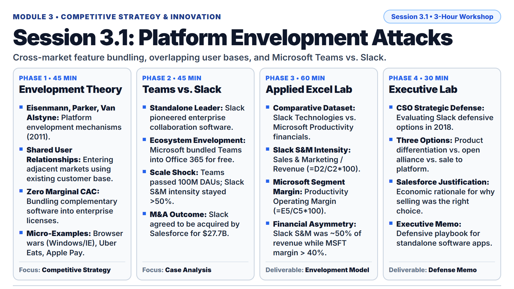

* **Lecture Presentation:** [Download Slides (PDF)](slides/session_3_1_lecture.pdf)

* **Keywords:** Platform Envelopment, Overlapping User Bases, Functionality Bundling, Customer Foreclosure, Ecosystem Enclosure, S&M Intensity (Sales and Marketing Intensity), ISV (Independent Software Vendor).
* **Main Theories:**
  * [Thomas R. Eisenmann, Geoffrey G. Parker, and Marshall W. Van Alstyne (2011) Platform Envelopment](https://en.wikipedia.org/wiki/Platform_envelopment): Strategic Management Journal. An established platform owner in one market enters an adjacent market by bundling functionality into its existing multi-sided platform, leveraging shared user relationships and common components to foreclose standalone competitors.
  * [Tying, Bundling and Antitrust Foreclosure in Digital Ecosystems](https://en.wikipedia.org/wiki/Tying_(commerce)): Economic mechanisms where zero-marginal-cost software distribution eliminates a standalone competitor's ability to finance customer acquisition, forcing exit or acquisition.
* **Micro-Examples:**
  * Operating System Envelopment of Web Browsers: Microsoft bundling Internet Explorer directly into the Windows operating system in the late 1990s, devastating standalone market pioneer Netscape Navigator.
  * Ride-Hailing Envelopment of Food Delivery: Uber embedding Uber Eats directly within its primary consumer ride-hailing application, sharing stored credit cards, GPS routing data, and driver networks to envelop standalone delivery apps.
  * Smartphone Envelopment of Contactless Payments: Apple integrating Apple Pay and the Wallet application directly into iOS hardware secure elements, enveloping standalone mobile payment applications.
* **Real Business Case:**
  * **Microsoft Teams vs. Slack Technologies (2018-2021 Enterprise Platform Envelopment):** In 2018, Slack Technologies was the premier standalone enterprise workplace messaging application, experiencing rapid organic adoption. In 2017, Microsoft launched Microsoft Teams and bundled it into existing commercial Microsoft 365 / Office 365 enterprise subscriptions at zero incremental license cost. While Slack had to spend over 50% of its annual revenue on sales and marketing to acquire corporate customers, Microsoft deployed its existing enterprise sales relationships and multi-product bundle. By 2020, Microsoft Teams surged past 115 million daily active users, while Slack's widening GAAP losses forced its board to accept a $27.7 billion acquisition by Salesforce in December 2020.
* **Lab Dataset:**
  * File Link: [data/session_3_1_envelopment_slack_msft.csv](data/session_3_1_envelopment_slack_msft.csv)
  * Columns: `Company_Entity`, `Fiscal_Year`, `Revenue_USD_M`, `Sales_Marketing_USD_M`, `Operating_Income_USD_M`, `Net_Income_USD_M`, `Filing_Source`.
* **Primary Filings & External References:**
  * [Slack Technologies Inc. Form 10-K Filings (SEC EDGAR CIK 0001764925)](https://www.sec.gov/edgar/browse/?CIK=0001764925)
  * [Microsoft Corporation Form 10-K Filings (SEC EDGAR CIK 0000789019)](https://www.sec.gov/edgar/browse/?CIK=0000789019)
* **Step-by-Step Lab Protocol (Exercise 1: Foundational Practice):**
  * **Step 1: Open the Dataset:** Launch Microsoft Excel. Open [data/session_3_1_envelopment_slack_msft.csv](data/session_3_1_envelopment_slack_msft.csv). Verify comparative financial numbers for Slack Technologies (FY2018-FY2020) and Microsoft Productivity Segment (FY2018-FY2020).
  * **Step 2: Inspect Primary Sources & Financial Terminology:**
    * Regulatory Baseline: Review the `Filing_Source` column (Item 8 of Slack Form 10-K and Microsoft Form 10-K).
    * Acronym Expansion: In enterprise software analysis, **S&M Intensity** represents **Sales and Marketing spending divided by Total Revenue** (the percentage of top-line revenue consumed by customer acquisition). **ISV** stands for **Independent Software Vendor** (third-party software companies developing applications for a broader platform ecosystem).
  * **Step 3: Calculate Slack Sales & Marketing Intensity:**
    * In cell H1, enter the column header `Sales_Marketing_Pct_Revenue`.
    * In cell H2, enter the formula: `=(D2/C2)*100` (Sales & Marketing divided by Revenue, multiplied by 100).
    * Copy the formula down for all Slack rows (rows 2, 3, and 4).
  * **Step 4: Calculate Microsoft Productivity Segment Operating Margin:**
    * In cell I1, enter the column header `Operating_Margin_Pct`.
    * In cell I5, enter the formula: `=(E5/C5)*100` (Operating Income divided by Revenue, multiplied by 100).
    * Copy the formula down for all Microsoft rows (rows 5, 6, and 7).
  * **Step 5: Synthesize Envelopment Asymmetry:**
    * Observe that Slack spent 58.2% (2018), 51.0% (2019), and 49.6% (2020) of its total revenue on sales and marketing just to stay competitive, resulting in heavy annual GAAP net losses (-$567M in FY2020).
    * In contrast, Microsoft's Productivity and Business Processes segment generated operating margins consistently exceeding 38% to 40%.
    * Conclude how bundling functionality allows an incumbent platform to distribute software at zero incremental customer acquisition cost, foreclosing standalone rivals.
* **Step-by-Step Strategic Decision Challenge (Exercise 2+: Advanced Problem Solving):**
  * **Strategic Problem:** Standalone software applications face structural disadvantages when an adjacent platform giant bundles equivalent functionality for free to an overlapping enterprise user base.
  * **Student Task:**
    1. Review Slack's financial numbers in your spreadsheet. Explain why product quality alone was insufficient to counter Microsoft Teams' free bundling strategy.
    2. Evaluate three strategic options available to Slack's executive leadership in 2020:
       * Option A: Continue competing independently by expanding marketing debt.
       * Option B: Form an open interoperability alliance with Zoom, Box, and Dropbox.
       * Option C: Sell the company to an enterprise cloud aggregator (Salesforce).
    3. Draft a structured, three-bullet decision brief addressed to Slack's Board of Directors: Justify why selling to Salesforce for $27.7 billion was the economically rational decision for shareholders, and outline how Salesforce should integrate Slack into its broader CRM cloud platform.

---

### Session 3.2: Strategic Cannibalization

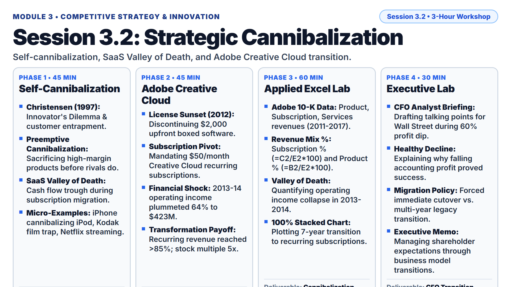

* **Lecture Presentation:** [Download Slides (PDF)](slides/session_3_2_lecture.pdf)

* **Keywords:** Cannibalization, The Innovator's Dilemma, SaaS Valley of Death, Perpetual License, Recurring Subscription, SaaS (Software as a Service), CFO (Chief Financial Officer).
* **Main Theories:**
  * [Clayton M. Christensen (1997) The Innovator's Dilemma: When New Technologies Cause Great Firms to Fail](https://en.wikipedia.org/wiki/The_Innovator%27s_Dilemma): Established industry leaders fail because their resource allocation processes listen to their most profitable legacy customers, rejecting lower-margin, disruptive business models until external competitors capture the market.
  * [Strategic Self-Cannibalization](https://en.wikipedia.org/wiki/Cannibalization_(marketing)): The deliberate introduction of a new digital platform or business model that destroys sales of existing highly profitable products, executed proactively to preempt competitor entry and dominate long-term market architecture.
* **Micro-Examples:**
  * Smartphone Cannibalization of Dedicated Hardware: Apple deliberately integrated music playback into the iPhone, rendering its own standalone iPod business obsolete while securing mobile computing dominance.
  * Physical Media vs. Digital Streaming: Netflix launched online streaming in 2007, actively undermining its core profitable DVD-by-mail rental business to preempt digital video disruption.
  * Photographic Film vs. Digital Cameras: Eastman Kodak invented the digital camera in 1975 but suppressed commercialization to protect its high-margin chemical film and printing paper manufacturing monopoly, leading to bankruptcy in 2012.
* **Real Business Case:**
  * **Adobe Inc. Creative Cloud Transformation (2011-2017 SaaS Transition):** In 2012, Adobe announced it would permanently cease selling perpetual boxed licenses for Creative Suite (which sold for $1,500 to $2,500 upfront per license). Instead, Adobe forced customers into a $50/month recurring subscription model called Creative Cloud. During 2013 and 2014 (the "SaaS Valley of Death"), Adobe's total revenue declined and GAAP operating income plummeted by 64% (from $1,180M in 2012 down to $423M in 2013) as upfront license cash vanished before monthly recurring payments accumulated. Wall Street punished the stock. However, by 2017, subscription revenue exceeded 85% of total revenues, operating income expanded to $2.17 billion, and Adobe's market valuation increased five-fold.
* **Lab Dataset:**
  * File Link: [data/session_3_2_cannibalization_adobe.csv](data/session_3_2_cannibalization_adobe.csv)
  * Columns: `Fiscal_Year`, `Product_Revenue_USD_M` (Perpetual license revenue in millions of USD), `Subscription_Revenue_USD_M` (Cloud subscription revenue in millions of USD), `Services_Support_Revenue_USD_M`, `Total_Revenue_USD_M`, `Operating_Income_USD_M`, `Filing_Source`.
* **Primary Filings & External References:**
  * [Adobe Inc. Form 10-K Filings (SEC EDGAR CIK 0000796343)](https://www.sec.gov/edgar/browse/?CIK=0000796343)
  * [SEC EDGAR Company Search Database](https://www.sec.gov/edgar/searchedgar/companysearch)
* **Step-by-Step Lab Protocol (Exercise 1: Foundational Practice):**
  * **Step 1: Open the Dataset:** Launch Microsoft Excel. Open [data/session_3_2_cannibalization_adobe.csv](data/session_3_2_cannibalization_adobe.csv). Verify Adobe audited figures for fiscal years 2011 through 2017.
  * **Step 2: Inspect Primary Sources & Financial Terminology:**
    * Regulatory Baseline: Review the `Filing_Source` column (Item 8 of Adobe Form 10-K).
    * Acronym Expansion: In software finance, **SaaS** stands for **Software as a Service** (cloud delivery where applications are hosted centrally and licensed on a recurring monthly/annual subscription rather than installed via perpetual license). **CFO** stands for **Chief Financial Officer** (the top corporate executive responsible for capital structure, financial planning, and Wall Street communications).
  * **Step 3: Calculate Revenue Mix Percentages:**
    * In cell H1, enter the column header `Subscription_Pct_Total`.
    * In cell H2, enter the formula: `=(C2/E2)*100` (Subscription Revenue divided by Total Revenue, multiplied by 100).
    * In cell I1, enter the column header `Product_Pct_Total`.
    * In cell I2, enter the formula: `=(B2/E2)*100` (Perpetual Product Revenue divided by Total Revenue, multiplied by 100).
    * Copy both formulas down through row 8 (2011 to 2017).
  * **Step 4: Identify the "SaaS Valley of Death":**
    * In your spreadsheet, inspect Total Revenue (`Column E`) and Operating Income (`Column F`) between 2012 and 2014.
    * Note how Operating Income collapsed from $1,180 million (2012) to $423 million (2013) and $413 million (2014) before exploding to $2,168 million in 2017.
  * **Step 5: Construct a 100% Stacked Area Transition Chart:**
    * Select Fiscal Year, Subscription Revenue, and Product Revenue.
    * Insert a 100% Stacked Area chart illustrating the complete crossover where subscription software expanded from 13.7% of revenues in 2012 to 85.9% in 2017.
* **Step-by-Step Strategic Decision Challenge (Exercise 2+: Advanced Problem Solving):**
  * **Strategic Problem:** Transitioning from upfront capital purchases to recurring subscriptions creates a multi-year cash flow trough (the SaaS Valley of Death) that invites hostile activist shareholder pressure and analyst downgrades.
  * **Student Task:**
    1. Imagine you are Adobe's CFO in late 2012 preparing guidance for Wall Street equity analysts. Operating income is projected to drop by over 60% in fiscal 2013.
    2. Using your spreadsheet numbers, draft three defensible communication points explaining why this temporary accounting collapse is proof of a successful platform transformation.
    3. Draft a structured, three-bullet decision brief addressed to Adobe's Chief Executive Officer: Formulate an actionable executive policy on whether to offer legacy customers a discounted multi-year grace period or execute an immediate hard cut-off of legacy perpetual licenses.

---

### Session 3.3: Disruptive Innovation in the Digital Era

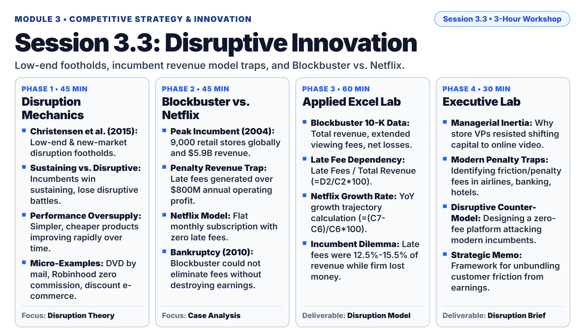

* **Lecture Presentation:** [Download Slides (PDF)](slides/session_3_3_lecture.pdf)

* **Keywords:** Disruptive Innovation, Low-End Disruption, New-Market Disruption, Incumbent Inertia, Trajectory of Performance, YoY (Year-over-Year), VHS (Video Home System).
* **Main Theories:**
  * [Clayton M. Christensen, Michael E. Raynor, and Rory McDonald (2015) What Is Disruptive Innovation?](https://hbr.org/2015/12/what-is-disruptive-innovation): Harvard Business Review. Disruptive innovation originates in low-end footholds (unattractive, low-margin segments ignored by incumbents) or new-market footholds (non-consumers). The entrant's product is initially simpler and cheaper, but improves along a rapid performance trajectory until it displaces established incumbents.
  * [Sustaining versus Disruptive Trajectories](https://en.wikipedia.org/wiki/Disruptive_innovation): Established incumbents consistently defeat entrants in sustaining technological battles (improving existing products for demanding profitable customers), but almost always lose disruptive battles against simpler, low-cost platform alternatives.
* **Micro-Examples:**
  * Video Rental vs. DVD by Mail: Blockbuster invested in expensive prime retail real estate with vast physical VHS and DVD selection; early Netflix offered slow mail delivery with limited titles but completely eliminated punitive late fees.
  * Retail Stock Brokerage: Traditional brokerages charged $30 to $50 per trade via human telephone brokers; Robinhood introduced smartphone-based, zero-commission fractional share trading for novice retail investors.
  * Enterprise Compute Hosting: Traditional IT hardware vendors sold multi-million dollar on-premise mainframe servers to corporate CIOs; early Amazon Web Services (AWS) launched primitive cloud storage for individual web developers at pennies per gigabyte.
* **Real Business Case:**
  * **Blockbuster Entertainment Inc. vs. Netflix Inc. (2001-2005 Incumbent Profit Trap):** In 2004, Blockbuster was the global video rental giant, operating over 9,000 physical retail stores and generating $5.9 billion in annual revenue. A substantial portion of its operating profit derived from "extended viewing fees" (late fees charged to customers who returned video tapes late). Early Netflix charged a predictable monthly subscription with no late fees. Blockbuster management could not copy Netflix's subscription model quickly because eliminating late fees would have immediately eliminated hundreds of millions in retail operating cash flow. Blockbuster filed for bankruptcy in September 2010.
* **Lab Dataset:**
  * File Link: [data/session_3_3_disruption_blockbuster.csv](data/session_3_3_disruption_blockbuster.csv)
  * Columns: `Company_Name`, `Fiscal_Year`, `Total_Revenue_USD_M`, `Extended_Viewing_Fees_USD_M` (Late fees in millions of USD), `Operating_Costs_USD_M`, `Net_Income_USD_M`, `Filing_Source`.
* **Primary Filings & External References:**
  * [Blockbuster Inc. Form 10-K Filings (SEC EDGAR CIK 0001086342)](https://www.sec.gov/edgar/browse/?CIK=0001086342)
  * [What Is Disruptive Innovation? (Harvard Business Review)](https://hbr.org/2015/12/what-is-disruptive-innovation)
* **Step-by-Step Lab Protocol (Exercise 1: Foundational Practice):**
  * **Step 1: Open the Dataset:** Launch Microsoft Excel. Open [data/session_3_3_disruption_blockbuster.csv](data/session_3_3_disruption_blockbuster.csv). Verify financial figures for Blockbuster (2001-2004) and Netflix (2001-2004).
  * **Step 2: Inspect Primary Sources & Financial Terminology:**
    * Regulatory Baseline: Review the `Filing_Source` column (Item 8 of Blockbuster Form 10-K).
    * Acronym Expansion: In corporate strategy analysis, **YoY** stands for **Year-over-Year** (a percentage calculation measuring the growth of a metric compared to the exact same period one year prior). **VHS** stands for **Video Home System** (analog magnetic tape cassettes used for physical home video playback prior to DVDs).
  * **Step 3: Calculate Late Fee Contribution for Blockbuster:**
    * In cell H1, enter the column header `Late_Fees_Pct_Revenue`.
    * In cell H2, enter the formula: `=(D2/C2)*100` (Extended Viewing Fees divided by Total Revenue, multiplied by 100).
    * Copy the formula down through row 5 (2001 to 2004).
  * **Step 4: Calculate Netflix Year-over-Year (YoY) Revenue Growth:**
    * In cell I6, enter the column header `Netflix_YoY_Growth_Pct`.
    * In cell I7, enter the formula: `=(C7-C6)/C6*100`.
    * Copy the formula down through row 9 (2002 to 2004).
  * **Step 5: Synthesize the Incumbent Dilemma:**
    * Note that late fees contributed between 12.5% and 15.5% of Blockbuster's total revenue ($741M to $854M annually). Because Blockbuster was already reporting net losses, eliminating late fees would have immediately triggered debt covenant defaults.
    * Contrast this with Netflix's YoY revenue growth rates of 249% (2002), 99% (2003), and 92% (2004).
* **Step-by-Step Strategic Decision Challenge (Exercise 2+: Advanced Problem Solving):**
  * **Strategic Problem:** Incumbent corporations are trapped by their existing profit engines: senior executives cannot voluntarily eliminate customer friction fees when corporate operating profits depend directly on those fees.
  * **Student Task:**
    1. Using your spreadsheet numbers, explain why Blockbuster's store managers and regional franchise owners resisted shifting capital into Netflix-style digital mail delivery.
    2. Identify an established industry today where an incumbent earns substantial profits from customer friction fees (e.g., airline baggage change fees, commercial banking overdraft fees, hotel resort fees).
    3. Draft a structured, three-bullet decision brief addressed to the Board of Directors of an incumbent institution: Formulate an actionable plan to launch a separate, autonomous digital platform unit unencumbered by legacy profit requirements to preempt low-end disruptors.

---

### Session 3.4: Open Innovation & Ecosystem Orchestration

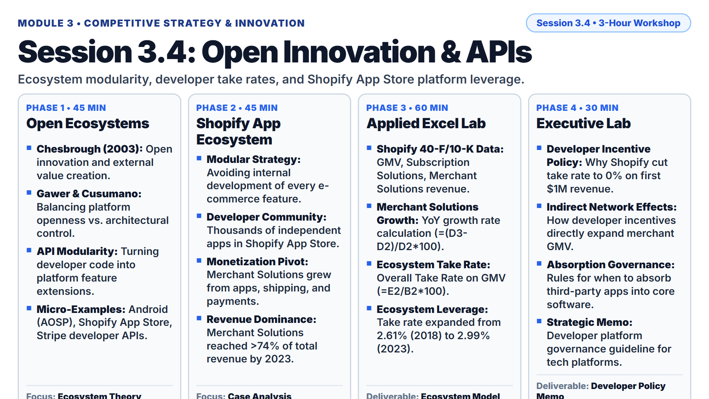

* **Lecture Presentation:** [Download Slides (PDF)](slides/session_3_4_lecture.pdf)

* **Keywords:** Open Innovation, API (Application Programming Interface), Modularity, Value Co-Creation, Developer Governance, GMV (Gross Merchandise Volume), ISV (Independent Software Vendor).
* **Main Theories:**
  * [Henry Chesbrough (2003) Open Innovation: The New Imperative for Creating and Profiting from Technology](https://en.wikipedia.org/wiki/Open_innovation): Harvard Business School Press. Valuable commercial ideas can come from inside or outside the corporation and can go to market from inside or outside the company. Platform firms must open their technical boundaries to external innovators to capture distributed talent.
  * [Annabelle Gawer and Michael A. Cusumano (2014) Industry Platforms and Ecosystem Innovation](https://en.wikipedia.org/wiki/Software_ecosystem): Journal of Product Innovation Management. Architectural governance of platforms: how platform sponsors resolve the core tension between openness (stimulating external developer complementor innovation) and control (appropriating economic returns and safeguarding quality standards).
* **Micro-Examples:**
  * Mobile Operating Systems: Google releases Android source code via the Android Open Source Project (AOSP), allowing hardware OEMs (Samsung, Xiaomi) to manufacture devices while standardizing on proprietary Google Mobile Services (GMS) APIs.
  * Cloud Payment Infrastructure: Stripe opens developer-friendly payment APIs, enabling any software programmer to embed global banking and card acceptance into a website using seven lines of code.
  * E-Commerce Storefront Extensions: Shopify provides modular APIs, allowing over 10,000 independent app developers to sell inventory management, marketing, and cross-border shipping plugins to merchants.
* **Real Business Case:**
  * **Shopify Inc. (2018-2023 Developer Ecosystem Orchestration):** Rather than attempting to build every e-commerce feature internally, Shopify designed an open modular software architecture powered by public APIs. Independent software vendors (ISVs) build specialized applications (tax calculation, loyalty programs, email automation) and distribute them via the Shopify App Store. To attract premier global developers, Shopify instituted a developer-friendly fee policy in 2021: 0% revenue share on a developer's first $1,000,000 in annual gross app revenue (compared to Apple's and Google's standard 30% take rates). By FY2023, Shopify's Gross Merchandise Volume (GMV) reached $235.9 billion, and Merchant Solutions revenue grew to $5.22 billion (74% of total revenues), driven by partner integrations.
* **Lab Dataset:**
  * File Link: [data/session_3_4_open_apis_shopify.csv](data/session_3_4_open_apis_shopify.csv)
  * Columns: `Fiscal_Year`, `GMV_USD_M` (Gross Merchandise Volume in millions of USD), `Subscription_Solutions_USD_M`, `Merchant_Solutions_USD_M`, `Total_Revenue_USD_M`, `Merchant_Solutions_Pct_Total`, `Filing_Source`.
* **Primary Filings & External References:**
  * [Shopify Inc. Form 40-F/10-K Filings (SEC EDGAR CIK 0001594805)](https://www.sec.gov/edgar/browse/?CIK=0001594805)
  * [Shopify Developer API Platform Architecture Documentation](https://shopify.dev/docs/api)
* **Step-by-Step Lab Protocol (Exercise 1: Foundational Practice):**
  * **Step 1: Open the Dataset:** Launch Microsoft Excel. Open [data/session_3_4_open_apis_shopify.csv](data/session_3_4_open_apis_shopify.csv). Verify Shopify financial numbers for fiscal years 2018 through 2023.
  * **Step 2: Inspect Primary Sources & Financial Terminology:**
    * Regulatory Baseline: Review the `Filing_Source` column (Item 8 of Shopify Form 40-F / Form 10-K).
    * Acronym Expansion: In software architecture, **API** stands for **Application Programming Interface** (standardized code protocols that allow external software applications to communicate and exchange data with a platform). **GMV** stands for **Gross Merchandise Volume** (the total dollar value of all orders processed across all merchant storefronts). **ISV** stands for **Independent Software Vendor**.
  * **Step 3: Calculate Merchant Solutions Year-over-Year Growth:**
    * In cell H1, enter the column header `Merchant_Solutions_YoY_Growth_Pct`.
    * In cell H3, enter the formula: `=(D3-D2)/D2*100`.
    * Copy the formula down through row 7 (2019 to 2023).
  * **Step 4: Calculate Total Platform Take Rate on GMV:**
    * In cell I1, enter the column header `Overall_Take_Rate_Pct`.
    * In cell I2, enter the formula: `=(E2/B2)*100` (Total Revenue divided by GMV, multiplied by 100).
    * Copy the formula down through row 7.
  * **Step 5: Analyze Ecosystem Leverage:**
    * Observe that Shopify's overall take rate expanded from 2.61% (2018) to 2.99% (2023) as GMV expanded from $41.1B to $235.9B.
    * Conclude how open APIs allow a platform owner to generate billions in transaction revenue from complementary software developed and maintained entirely at external developer expense.
* **Step-by-Step Strategic Decision Challenge (Exercise 2+: Advanced Problem Solving):**
  * **Strategic Problem:** Platform owners face a delicate governance balance: if the platform absorbs (sherlocks) the most profitable third-party apps into core software, developers lose trust and migrate; if it absorbs nothing, user experience becomes fragmented and inconsistent.
  * **Student Task:**
    1. Using your spreadsheet numbers, evaluate why Shopify surrendered developer commission fees on the first $1M in revenue to stimulate indirect network effects on total GMV.
    2. Analyze the strategic risks of platform "enclosure": when Apple or Shopify clones a successful third-party developer's feature, evaluate the impact on external venture capital investment in the developer ecosystem.
    3. Draft a structured, three-bullet decision brief addressed to Shopify's Chief Product Officer: Formulate clear architectural governance rules defining exactly when the platform should build a feature into its core offering versus when it should preserve the category for external independent software vendors.

---

## Module 4: Real-World Case Studies & Strategic Synthesis

### Session 4.1: Comprehensive Case Study: Amazon

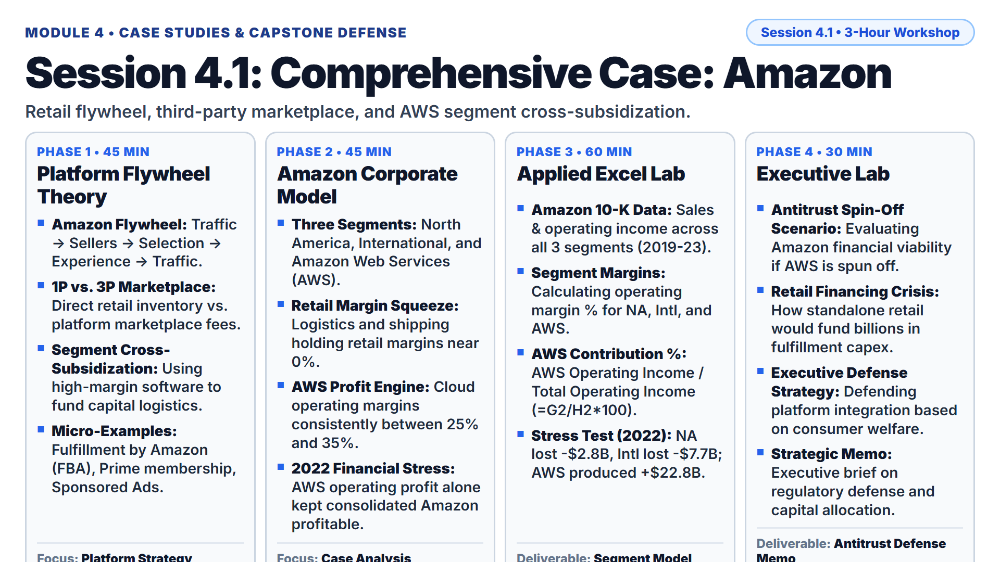

* **Lecture Presentation:** [Download Slides (PDF)](slides/session_4_1_lecture.pdf)

* **Keywords:** Retail Flywheel, AWS (Amazon Web Services), 3P (Third-Party Marketplace), 1P (First-Party Retail), Cross-Subsidization, Segment Operating Margin, FBA (Fulfillment by Amazon).
* **Main Theories:**
  * [The Platform Flywheel and Virtuous Feedback Loops](https://en.wikipedia.org/wiki/Virtuous_circle_and_vicious_circle) ([Amazon Flywheel Architecture](https://en.wikipedia.org/wiki/Platform_economy)): Jim Collins and Jeff Bezos. Lower cost structure enables lower prices; lower prices attract more customer visits; increased traffic attracts independent third-party (3P) merchants; expanded merchant selection enhances customer experience, spinning the flywheel faster.
  * [Multi-Segment Cross-Subsidization in Enterprise Platforms](https://en.wikipedia.org/wiki/Cross_subsidization): Deploying high-margin enterprise cloud infrastructure cash flows (AWS) to subsidize capital-intensive, low-margin physical logistics networks (1P retail and FBA).
* **Micro-Examples:**
  * Fulfillment by Amazon (FBA): Amazon transformed its internal warehousing cost center into a paid, high-margin platform service for millions of third-party merchants.
  * Amazon Prime Membership: An annual consumer subscription that eliminates shipping friction, doubling average annual member spending while sharply increasing multi-homing switching costs.
  * Amazon Retail Media Advertising: High-margin sponsored product search ads embedded directly into the shopping catalog, generating over $46 billion in high-margin advertising cash.
* **Real Business Case:**
  * **Amazon.com, Inc. (2019-2023 Segment Cross-Subsidization):** Amazon operates three reporting segments: North America Retail, International Retail, and Amazon Web Services (AWS). In FY2022, global macroeconomic headwinds, surging shipping costs, and excess post-pandemic warehouse capacity produced massive retail operating losses: North America lost -$2.85 billion, and International lost -$7.75 billion (total retail operating loss of -$10.59 billion). However, AWS generated $22.84 billion in operating profit (28.8% operating margin), single-handedly keeping Amazon profitable. By FY2023, retail logistics efficiencies recovered, but AWS continued to provide over 67% of Amazon's $36.85 billion consolidated operating income.
* **Lab Dataset:**
  * File Link: [data/session_4_1_case_amazon.csv](data/session_4_1_case_amazon.csv)
  * Columns: `Fiscal_Year`, `North_America_Sales_USD_M`, `North_America_Op_Income_USD_M`, `International_Sales_USD_M`, `International_Op_Income_USD_M`, `AWS_Sales_USD_M`, `AWS_Op_Income_USD_M`, `Consolidated_Op_Income_USD_M`, `Filing_Source`.
* **Primary Filings & External References:**
  * [Amazon.com, Inc. Form 10-K Filings (SEC EDGAR CIK 0001018724)](https://www.sec.gov/edgar/browse/?CIK=0001018724)
  * [SEC EDGAR Company Search Database](https://www.sec.gov/edgar/searchedgar/companysearch)
* **Step-by-Step Lab Protocol (Exercise 1: Foundational Practice):**
  * **Step 1: Open the Dataset:** Launch Microsoft Excel. Open [data/session_4_1_case_amazon.csv](data/session_4_1_case_amazon.csv). Verify segment operating results for Amazon (FY2019 through FY2023).
  * **Step 2: Inspect Primary Sources & Financial Terminology:**
    * Regulatory Baseline: Review the `Filing_Source` column (Item 8, Note 10 - Segment Information of Amazon Form 10-K).
    * Acronym Expansion: In corporate strategy, **AWS** stands for **Amazon Web Services** (Amazon's cloud infrastructure division providing on-demand computing power, storage, and databases). **1P** stands for **First-Party Retail** (where Amazon buys inventory wholesale and sells directly to consumers). **3P** stands for **Third-Party Marketplace** (where external merchants sell directly to consumers, paying Amazon commission and fulfillment fees). **FBA** stands for **Fulfillment by Amazon** (Amazon's warehousing, packing, and delivery service for merchants).
  * **Step 3: Calculate Segment Operating Margins:**
    * In cell J1, enter header `NA_Op_Margin_Pct`. In cell J2: `=(C2/B2)*100`.
    * In cell K1, enter header `Intl_Op_Margin_Pct`. In cell K2: `=(E2/D2)*100`.
    * In cell L1, enter header `AWS_Op_Margin_Pct`. In cell L2: `=(G2/F2)*100`.
    * Copy down through row 6 (2019 to 2023).
  * **Step 4: Calculate AWS Profit Contribution Percentage:**
    * In cell M1, enter header `AWS_Pct_Total_Operating_Profit`.
    * In cell M2, enter the formula: `=(G2/H2)*100` (AWS Operating Income divided by Consolidated Operating Income, multiplied by 100).
    * Copy down through row 6.
  * **Step 5: Examine the 2022 Stress Test:**
    * Observe that in 2022, consolidated operating income was $12,248M. AWS generated $22,841M, meaning AWS accounted for over 186% of Amazon's total net operating profits while retail absorbed billions in expansion losses.
* **Step-by-Step Strategic Decision Challenge (Exercise 2+: Advanced Problem Solving):**
  * **Strategic Problem:** Antitrust regulatory authorities in the US and EU have proposed structural separation remedies, arguing that Amazon uses monopoly cloud profits from AWS to unfairly subsidize predatory pricing and below-cost logistics in its retail marketplace.
  * **Student Task:**
    1. Using your spreadsheet model, simulate a regulatory scenario where AWS is legally spun off as an entirely independent public corporation. Calculate the standalone operating margin of Amazon Retail in 2022 without AWS cash flows.
    2. How would an independent Amazon Retail business finance its $50+ billion annual capital expenditure commitments in automated fulfillment centers and delivery vans without AWS profits?
    3. Draft a structured, three-bullet legal and strategic memorandum addressed to the Federal Trade Commission (FTC): Formulate a rigorous economic defense demonstrating how Amazon's integrated platform structure generates lower prices, faster delivery, and billions in infrastructure investments that benefit independent small businesses and consumers.

---

### Session 4.2: Comprehensive Case Study: Apple

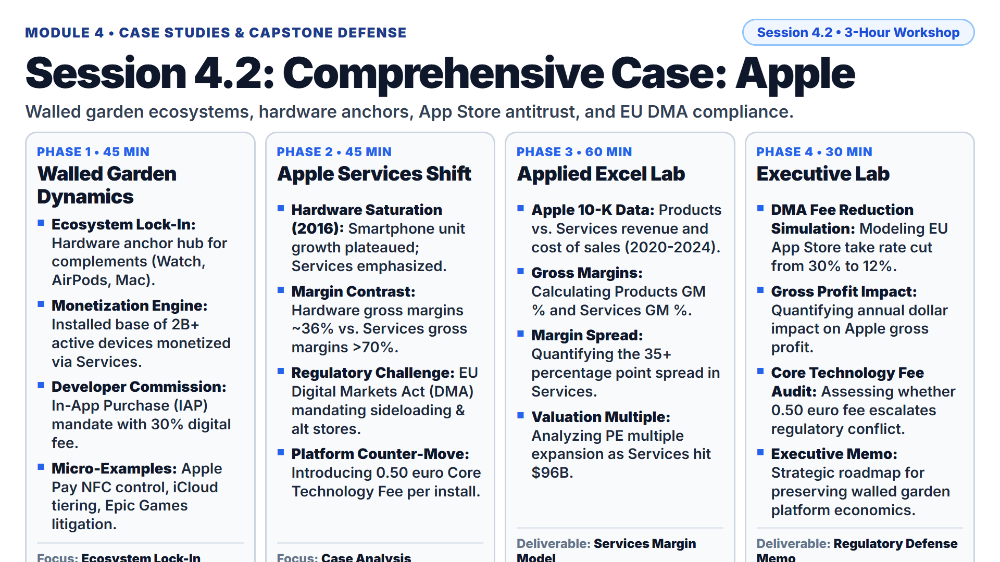

* **Lecture Presentation:** [Download Slides (PDF)](slides/session_4_2_lecture.pdf)

* **Keywords:** Walled Garden, App Store Take Rate, Services Segment, Architectural Lock-In, Platform Antitrust, IAP (In-App Purchase), DMA (Digital Markets Act), EU (European Union).
* **Main Theories:**
  * [Platform Ecosystem Complements and Architectural Control](https://en.wikipedia.org/wiki/Complementary_good): Controlling proprietary hardware, operating systems, and developer monetization rules to capture extraordinary economic rents from third-party complementary software developers.
  * [Two-Sided Platform Antitrust and Contestability](https://en.wikipedia.org/wiki/Digital_Markets_Act): Regulatory enforcement of gatekeeper obligations (such as the European Union Digital Markets Act and Epic Games v. Apple), examining whether closed "walled gardens" protect user privacy or extract monopolistic anti-steering rents.
* **Micro-Examples:**
  * Hardware Anchor Hub: The iPhone acts as the central biometric identity and transaction hub for high-margin complementary devices (Apple Watch, AirPods, iPad, Mac).
  * Services Installed Base Monetization: Apple monetizes its global installed base of over 2.2 billion active devices through iCloud storage, Apple Music, Apple Pay, and the App Store.
  * Strict In-App Purchase Rules: Mandating that all digital goods and services purchased inside iOS apps must utilize Apple's In-App Purchase (IAP) engine, paying a 30% commission (15% for small developers).
* **Real Business Case:**
  * **Apple Inc. Services Transformation (2020-2024 Margin Expansion):** As global smartphone hardware shipments reached market maturity around 2016, Apple transitioned its primary investor narrative toward its high-margin "Services" division. While Products (hardware) deliver gross margins between 35% and 37%, Services generates gross margins between 66% and 74%. In 2020, Epic Games filed antitrust lawsuits challenging Apple's 30% fee, leading to worldwide regulatory scrutiny. In March 2024, the European Union's Digital Markets Act (DMA) forced Apple to allow alternative app stores and third-party payment processing in the EU, prompting Apple to introduce a new "Core Technology Fee" of 0.50 euros per annual install to protect its ecosystem revenues.
* **Lab Dataset:**
  * File Link: [data/session_4_2_case_apple.csv](data/session_4_2_case_apple.csv)
  * Columns: `Fiscal_Year`, `Products_Revenue_USD_M`, `Products_Cost_of_Sales_USD_M`, `Services_Revenue_USD_M`, `Services_Cost_of_Sales_USD_M`, `Total_Net_Sales_USD_M`, `Filing_Source`.
* **Primary Filings & External References:**
  * [Apple Inc. Form 10-K Filings (SEC EDGAR CIK 0000320193)](https://www.sec.gov/edgar/browse/?CIK=0000320193)
  * [European Commission Digital Markets Act Gatekeeper Legislation](https://digital-markets-act.ec.europa.eu/index_en)
* **Step-by-Step Lab Protocol (Exercise 1: Foundational Practice):**
  * **Step 1: Open the Dataset:** Launch Microsoft Excel. Open [data/session_4_2_case_apple.csv](data/session_4_2_case_apple.csv). Verify Apple revenue and cost data for fiscal years 2020 through 2024.
  * **Step 2: Inspect Primary Sources & Financial Terminology:**
    * Regulatory Baseline: Review the `Filing_Source` column (Item 8 of Apple Form 10-K).
    * Acronym Expansion: In platform antitrust, **IAP** stands for **In-App Purchase** (Apple's proprietary billing protocol). **DMA** stands for the **Digital Markets Act** (European Union legislation regulating large tech gatekeepers). **EU** stands for the **European Union**.
  * **Step 3: Calculate Products (Hardware) Gross Margin Percentage:**
    * In cell H1, enter the column header `Products_Gross_Margin_Pct`.
    * In cell H2, enter the formula: `=((B2-C2)/B2)*100` (Hardware Revenue minus Hardware Cost, divided by Hardware Revenue, multiplied by 100).
    * Copy the formula down through row 6 (2020 to 2024).
  * **Step 4: Calculate Services Gross Margin Percentage:**
    * In cell I1, enter the column header `Services_Gross_Margin_Pct`.
    * In cell I2, enter the formula: `=((D2-E2)/D2)*100` (Services Revenue minus Services Cost, divided by Services Revenue, multiplied by 100).
    * Copy the formula down through row 6.
  * **Step 5: Calculate the Margin Spread:**
    * In cell J1, enter header `Margin_Spread_Pct`. In cell J2: `=I2-H2`.
    * Observe that Services gross margin (73.9% in 2024) is approximately 37 percentage points higher than hardware gross margin (36.9%).
    * Conclude why Apple's equity market valuation multiple expanded from ~15x P/E to ~30x P/E as Services revenue reached $96.17 billion in 2024.
* **Step-by-Step Strategic Decision Challenge (Exercise 2+: Advanced Problem Solving):**
  * **Strategic Problem:** Antitrust regulatory mandates in Europe (EU DMA) and Department of Justice lawsuits threaten to dismantle Apple's 30% App Store commission structure and walled-garden exclusivity.
  * **Student Task:**
    1. Using your spreadsheet model, simulate a scenario where regulatory mandates force Apple to lower its global App Store take rate from 30% to 12%. If App Store commissions represent 35% of total Services revenue, calculate the estimated annual dollar impact on Apple's gross profit.
    2. Evaluate Apple's strategic counter-measure in the EU: introducing a 0.50 euro "Core Technology Fee" per annual app install over 1 million downloads. Does this fee comply with the spirit of the DMA, or does it invite multi-billion euro regulatory fines?
    3. Draft a structured, three-bullet decision brief addressed to Apple's Chief Executive Officer: Formulate an actionable executive strategy detailing how Apple should restructure its developer monetization terms globally to maximize revenue retention while resolving ongoing antitrust litigation.

---

### Session 4.3: Applied Digital Learning & Empirical Industry Evidence

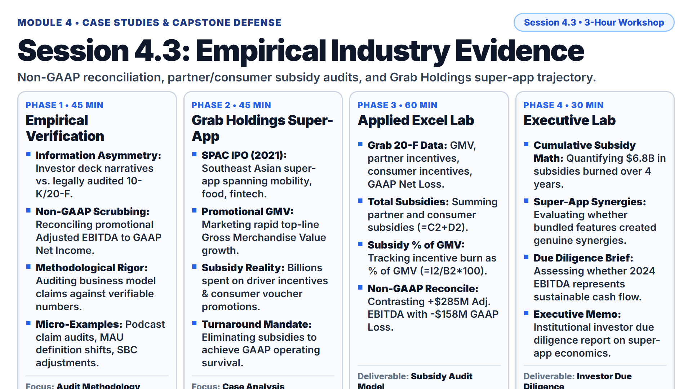

* **Lecture Presentation:** [Download Slides (PDF)](slides/session_4_3_lecture.pdf)

* **Keywords:** Empirical Evidence, Primary Source Fact-Checking, Video Lecture Audit, Non-GAAP Reconciliation, SPAC (Special Purpose Acquisition Company), EBITDA (Earnings Before Interest, Taxes, Depreciation, and Amortization).
* **Main Theories:**
  * [Statutory Disclosure Integrity and Regulatory Compliance](https://en.wikipedia.org/wiki/Regulatory_compliance): Distinguishing promotional corporate narratives (podcast interviews, conference keynote presentations) from legally binding, audited regulatory disclosures (SEC Form 10-K, Form 20-F, Form S-4).
  * [Empirical Methodology in Corporate Strategy & Non-GAAP Reconciliation](https://en.wikipedia.org/wiki/Financial_statement_analysis): Rigorously auditing non-GAAP financial adjustments (such as "Adjusted EBITDA" and stock-based compensation add-backs) to identify underlying cash burn and operational sustainability.
* **Micro-Examples:**
  * Podcast Fact-Checking: A startup founder announces on a technology podcast that their platform has "achieved operational profitability"; auditing the 10-K reveals positive "Adjusted EBITDA" achieved only by adding back $300 million in executive stock grants while reporting a substantial GAAP Net Loss.
  * Active User Metric Definitions: A corporate marketing deck announces 60 million "Registered Members"; the SEC filing footnote reveals that transacting "Active Users" in the past 90 days totaled only 11 million.
* **Real Business Case:**
  * **Grab Holdings Limited (2021-2024 Southeast Asian Super-App Audit):** Southeast Asian super-app Grab went public in December 2021 via a SPAC merger, pitching public investors on an integrated multi-sided platform combining ride-hailing, food delivery, and digital financial payments. In promotional roadshows, management highlighted hyper-growth in Gross Merchandise Value (GMV). However, financial statement audits of its Form 20-F filings revealed that Grab spent hundreds of millions of dollars annually on partner incentives (driver bonuses) and consumer incentives (discount vouchers), resulting in cumulative net losses exceeding $6.8 billion between 2021 and 2024. Under public market pressure, management curtailed subsidies, reporting positive Adjusted EBITDA in 2024 (+ $285M) while still reporting a GAAP Net Loss of -$158 million.
* **Lab Dataset:**
  * File Link: [data/session_4_3_empirical_audit_grab.csv](data/session_4_3_empirical_audit_grab.csv)
  * Columns: `Fiscal_Year`, `Gross_Merchandise_Value_USD_M`, `Partner_Incentives_USD_M`, `Consumer_Incentives_USD_M`, `GAAP_Revenue_USD_M`, `Adjusted_EBITDA_USD_M`, `GAAP_Net_Loss_USD_M`, `Filing_Source`.
* **Primary Filings & External References:**
  * [Grab Holdings Limited Form 20-F Filings (SEC EDGAR CIK 0001855612)](https://www.sec.gov/edgar/browse/?CIK=0001855612)
  * [SEC EDGAR Company Search Database](https://www.sec.gov/edgar/searchedgar/companysearch)
* **Step-by-Step Lab Protocol (Exercise 1: Foundational Practice):**
  * **Step 1: Open the Dataset:** Launch Microsoft Excel. Open [data/session_4_3_empirical_audit_grab.csv](data/session_4_3_empirical_audit_grab.csv). Verify Grab financial numbers across fiscal years 2021 through 2024.
  * **Step 2: Inspect Primary Sources & Financial Terminology:**
    * Regulatory Baseline: Review the `Filing_Source` column (Item 18 of Grab Form 20-F).
    * Acronym Expansion: In corporate finance, **SPAC** stands for **Special Purpose Acquisition Company** (a publicly traded shell company formed specifically to merge with a private operational company, bypassing the traditional IPO underwriting process). **EBITDA** stands for **Earnings Before Interest, Taxes, Depreciation, and Amortization** (a widely utilized non-GAAP operational cash proxy that excludes non-cash depreciation and financing expenses).
  * **Step 3: Calculate Total Annual Subsidies and Incentives:**
    * In cell I1, enter the column header `Total_Incentives_USD_M`.
    * In cell I2, enter the formula: `=C2+D2` (Partner Incentives plus Consumer Incentives).
    * Copy the formula down through row 5 (2021 to 2024).
  * **Step 4: Calculate Subsidies as a Percentage of GMV:**
    * In cell J1, enter the column header `Incentives_Pct_GMV`.
    * In cell J2, enter the formula: `=(I2/B2)*100` (Total Incentives divided by GMV, multiplied by 100).
    * Copy the formula down through row 5.
  * **Step 5: Reconcile Non-GAAP EBITDA with Statutory GAAP Net Loss:**
    * Contrast Column F (`Adjusted_EBITDA`) with Column G (`GAAP_Net_Loss`).
    * In 2024, Grab reported positive Adjusted EBITDA of +$285M, but sustained an audited statutory GAAP Net Loss of -$158M.
    * Conclude why strategic analysts must audit statutory GAAP reconciliations rather than relying on non-GAAP management metrics.
* **Step-by-Step Strategic Decision Challenge (Exercise 2+: Advanced Problem Solving):**
  * **Strategic Problem:** Super-apps in developing markets frequently disguise operational unprofitability by reporting Adjusted EBITDA figures that add back stock-based compensation, lease expenses, and restructuring charges.
  * **Student Task:**
    1. In your spreadsheet, calculate the cumulative cash spent on partner and consumer incentives by Grab between 2021 and 2024 using the formula: `=SUM(C2:D5)`. Note that incentives totaled over $6.8 billion across four years.
    2. Evaluate whether Grab's "super-app" architecture generated true cross-selling operational synergies or merely accumulated multiple capital-intensive, low-margin businesses under a single corporate umbrella.
    3. Draft a structured, three-bullet institutional investment memorandum addressed to an investment committee: Formulate an actionable due diligence assessment on whether Grab's positive 2024 Adjusted EBITDA represents sustainable long-term cash generation or an artificial accounting artifact.

---

### Session 4.4: Final Strategic Assessment & Capstone Defense

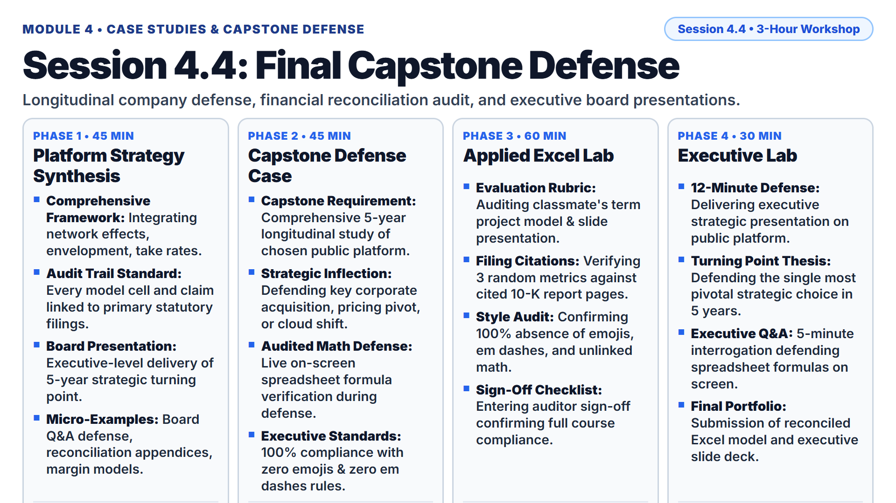

* **Lecture Presentation:** [Download Slides (PDF)](slides/session_4_4_lecture.pdf)

* **Keywords:** Capstone Defense, Longitudinal Analysis, Business Model Evaluation, Financial Audit Trail, Executive Presentation, Q&A (Question and Answer).
* **Main Theories:**
  * [Comprehensive Platform Business Model Synthesis](https://en.wikipedia.org/wiki/Business_model): Integrating network dynamics, multi-homing barriers, asset intensity, asymmetric pricing, competitive envelopment, and regulatory compliance into a unified executive strategic evaluation.
  * [Corporate Capital Allocation and Valuation in Digital Platforms](https://en.wikipedia.org/wiki/Corporate_finance): Defending an executive-level strategic turnaround or growth recommendation supported by reconciled spreadsheet financial exhibits.
* **Micro-Examples:**
  * Professional Boardroom Presentations: Presenting a 5-year strategic transformation to a corporate Board of Directors with precise financial reconciliation exhibits.
  * Live Financial Appendix Auditing: Defending every formula and primary regulatory filing citation during high-stakes executive questioning.
* **Real Business Case:**
  * **Final Project Capstone Defense (Longitudinal Enterprise Platform Defense):** Students deliver their final oral defense and submit their reconciled spreadsheet models analyzing a publicly traded platform corporation over a 5-year longitudinal historical period. Presentations synthesize how the firm resolved network effects, managed asset intensity, executed pricing discrimination, and defended against competitive envelopment, concluding with an actionable 3-bullet strategic mandate for senior leadership.
* **Lab Dataset:**
  * File Link: [data/session_4_4_capstone_audit_checklist.csv](data/session_4_4_capstone_audit_checklist.csv)
  * Columns: `Audit_Category`, `Audit_Inspection_Item`, `Primary_Filing_Requirement`, `Spreadsheet_Formula_Requirement`, `Pass_Fail_Threshold`.
* **Primary Filings & External References:**
  * [Term Project Guidelines & Capstone Scoring Rubric (Project.md)](Project.md)
  * [SEC EDGAR Company Search Database](https://www.sec.gov/edgar/searchedgar/companysearch)
* **Step-by-Step Lab Protocol (Exercise 1: Foundational Practice):**
  * **Step 1: Open the Evaluation Rubric:** Launch Microsoft Excel. Open [data/session_4_4_capstone_audit_checklist.csv](data/session_4_4_capstone_audit_checklist.csv).
  * **Step 2: Inspect Primary Sources & Financial Terminology:**
    * Acronym Expansion: In academic and corporate capstone evaluations, **Q&A** stands for **Question and Answer** (the formal defense period where examiners interrogate the student's methodology, formulas, and strategic recommendations).
    * Review the 5 core audit categories: Editorial Constraints, Primary Filing Citations, Formula Integrity, Strategic Framework Application, and Executive Brief Quality.
  * **Step 3: Conduct Pre-Defense Peer Audit:**
    * Open a classmate's term project presentation slide deck and companion Excel financial model.
    * Verify 100% compliance with course editorial constraints: confirm zero emojis and zero em/en dashes across all slides and tables (Pass/Fail).
  * **Step 4: Verify Three Primary Regulatory Citations:**
    * Select three random financial figures in the classmate's presentation deck.
    * Cross-reference each number against the cited Form 10-K or Form 20-F filing page in the companion spreadsheet model. Verify zero discrepancy.
  * **Step 5: Sign Off Capstone Audit Checklist:**
    * In the audit checklist workbook, record your name and student ID, certifying that the peer's capstone deliverables satisfy all standards established in [Term Project Guidelines (Project.md)](Project.md).
* **Step-by-Step Strategic Decision Challenge (Exercise 2+: Advanced Problem Solving):**
  * **Strategic Problem:** Executive presentations must synthesize complex financial modeling and platform economics into an authoritative, actionable strategic defense.
  * **Student Task (Final Capstone Defense Execution):**
    1. Deliver your 12-minute executive presentation analyzing your chosen publicly traded platform company across its 5-year longitudinal historical trajectory (satisfying all oral presentation criteria in [Project.md](Project.md)).
    2. Identify the single most critical strategic inflection point in the company's 5-year history (e.g., an aggressive pricing restructure, major cloud transition, or entry into an adjacent ecosystem).
    3. Defend your findings during an intensive 5-minute executive Q&A examination:
       * Demonstrate live on screen the mathematical formula link connecting your spreadsheet model to Item 8 of the company's audited SEC Form 10-K.
       * Conclude with your structured, three-bullet strategic recommendation addressed to the company's Board of Directors, providing an actionable roadmap for the next 24 months.

---
